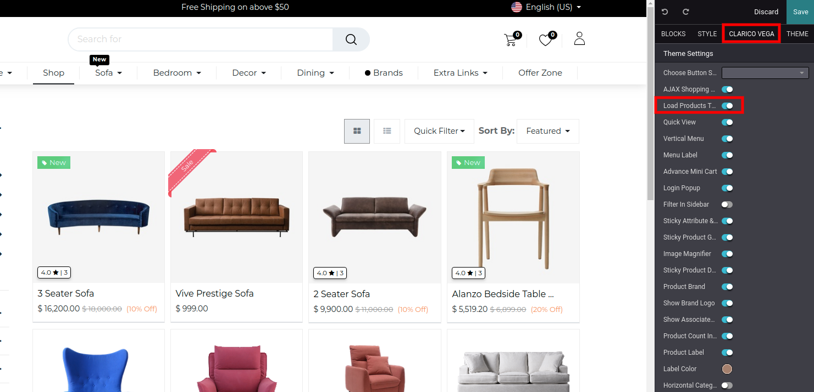
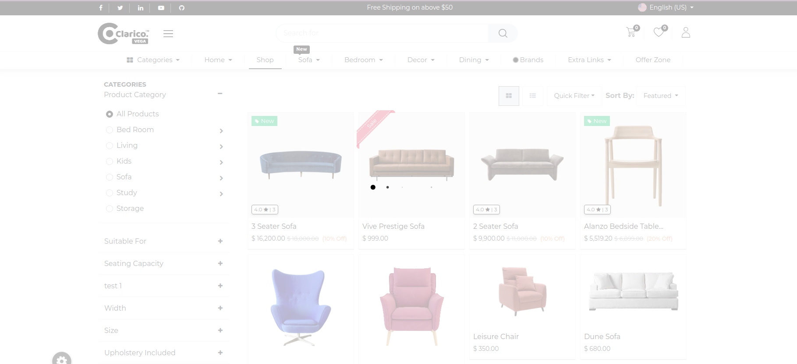

### Load Products Through Ajax

This feature provides the attribute filter data through ajax without reloading the page.

To enable/disable the Load through ajax, open Website Editor from the Website & click on **Clarico Vega** option. You can find an option named Load Product Through Ajax as shown as below screenshot. Enable that option and save the changes.

 

{:.alert-info} 
> 
> #### TIP
> 
> Load Products Through the Ajax feature will work with attributes only.
> 
> 
> 

 

