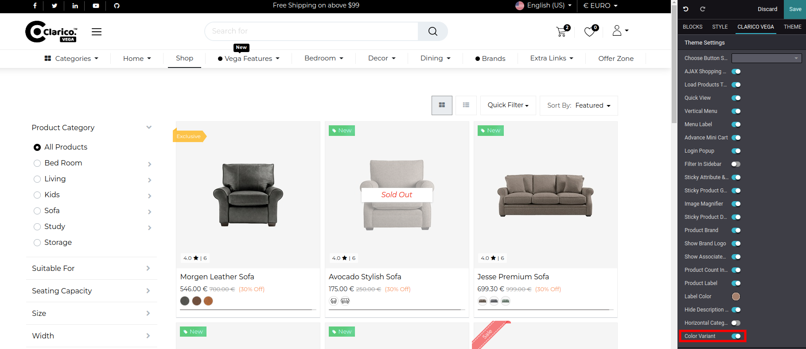
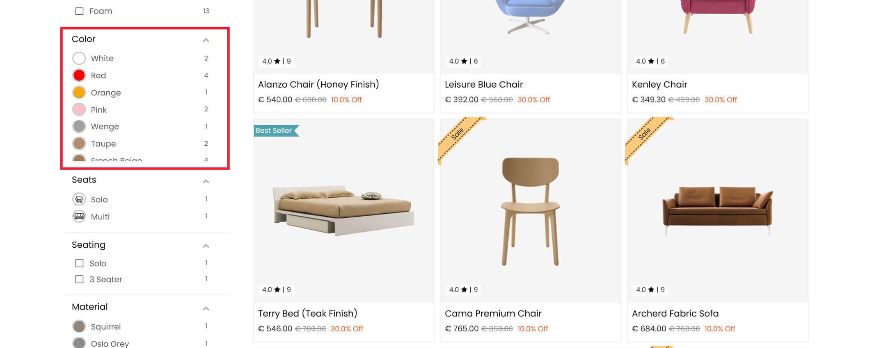

### Product Color Variants

* Using this feature, you can view the number of colors available for a particular product without visiting the product page.You will see a relevant image of the product once you hover over the color/image icon. 
* To enable/disable the Color Variants, open Website Editor from the Website & click on **Clarico Vega** Tab.
* You can find the option for enable/disable the Color Variants from that configuration as per the below screenshot.

* After enabling this feature you can see the **Color Variants In shop page**.

{:.alert-warning} 
> 
> #### NOTE
> 
> This feature will only work with Display Type of color attributes.The product has multiple Color attributes then the first color variant will be displayed.
> 

