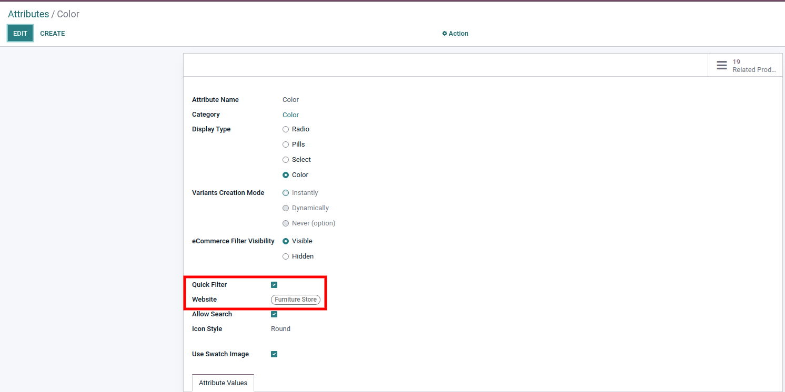
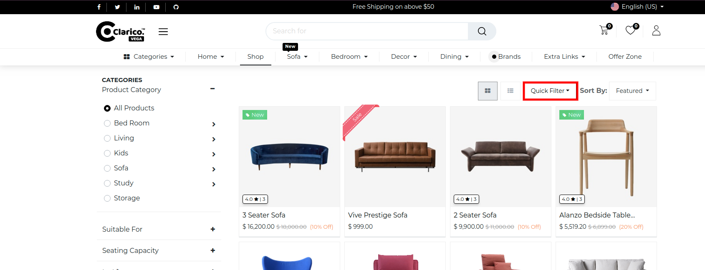

### Quick Filter

Steps to configure the Quick Filter:

* **Step 1:** In the admin side, go to **Website / Configurations / Attribute** and click on any attribute which you want to set as a quick filter.
* **Step 2:** You can see that there is one selection field like "Quick Filter". Check this button for setting an attribute as a quick filter and set the website if you want to set this on a particular website.

* **Step 3:** Save your changes and check on the shop page. You can see it at the top right corner. There is one button like **Quick Filter**. Click on this button. It will show the list of attributes that you configured as a Quick Filter.

