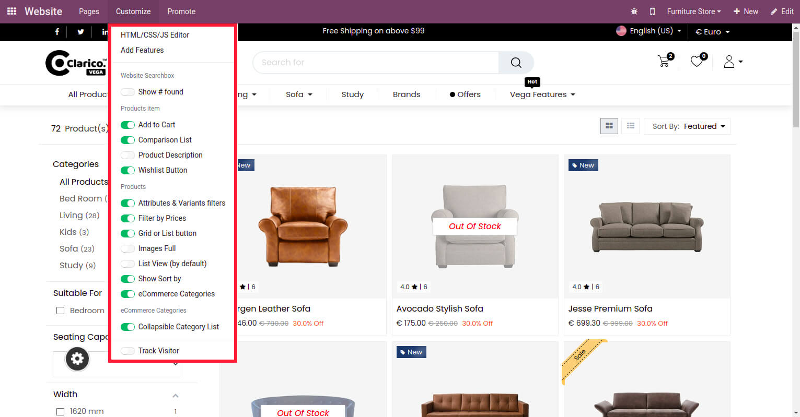

### Shop Page Configuration

You can manage your shop related configuration from top of the Shop page from your website as per the below screenshot.

{:.alert-warning} 
> 
> #### NOTE
> 
> It’s advisable, if you don't want to use Comparison List and Wishlist then disable from the front side(as shown in the above screenshot) instead of Website configurations from the backend.
> 
> 
> 

 

