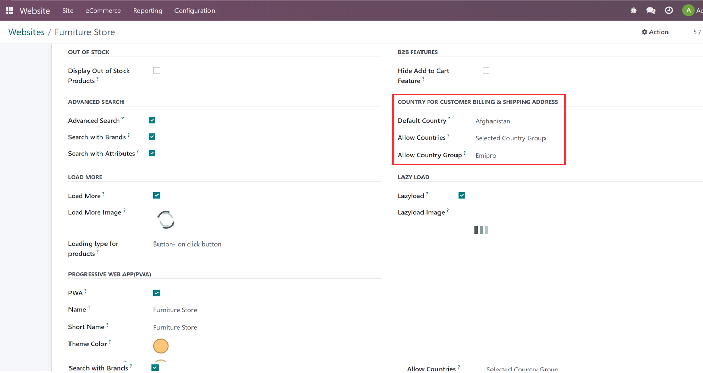
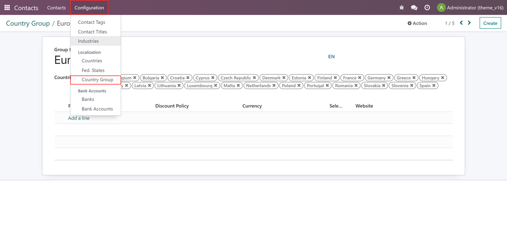
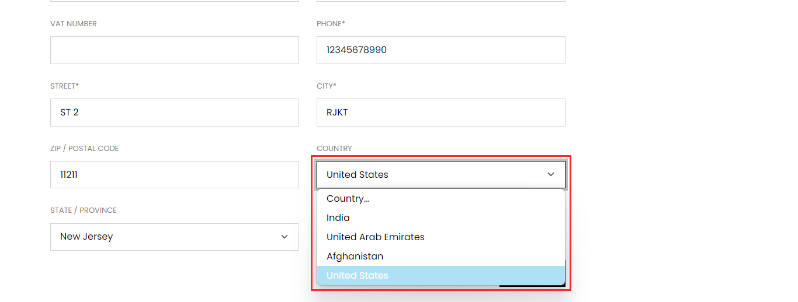

### Allow selected countries for order checkout

* Allow only selected country group to place orders as per your business needs

**Configurations**

1. Go to Website App -> Configurations -> websites and select any website and click on Theme Clarico Vega Tab and go to the COUNTRY FOR CUSTOMER BILLING & SHIPPING ADDRESS section.

2. Default Country: The user can set the default country in the country selection pop-up which is the same as the default country.

3. Allow Countries: Here you can select the single options from the dropdown. All countries Or selected country groups. So when the user selects the Selected Country Group then Allow Country Group fields will be displayed where you can select the country group.

**How to Create Country Group**

1.Go to Contacts App -> Configuration -> Localization -> Click on Country Group

2.Here you can Edit/Add a new country group.

3.While creating a new country group add a new group name and add the country that you would like to add to the selection and click on Save.

4. Once the above configuration is done click on the save & verify this feature in any address page.

