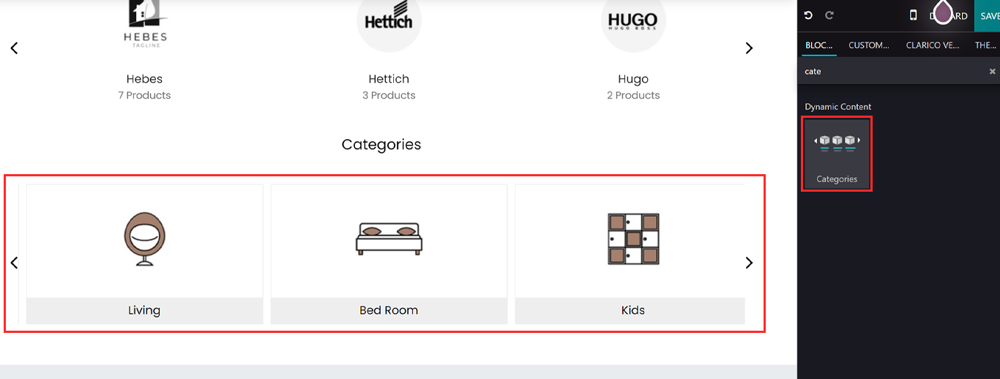
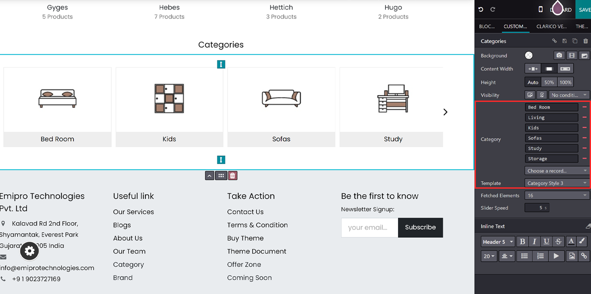

### Category Builder

* This dynamic snippet allows you to showcase the eCommerce categories.

**Configurations**

1. To configure Category Builder, go to the webpage where you want to configure the slider. Click on the ‘Edit’ button from the top right & drop the Category snippet from the Dynamic Content section shown in the below image.

2.Once drop the snippet you will see below the available options

Visibility: You can hide this snippet for mobile Or Desktop view Or Based on the conditions.
Category: Choose the category name from the search bar. Once you select the category it will be displayed above this option. So from there, you can remove the category.
Template: You can select the different snippet styles.
Fetched Elements: Records that you wanted to show.
Slider Speed: Set the slider speed.

{:.alert-warning} 
> 
> #### NOTE
> 
> **By default, it will display Max 16 brand in the slider.**
> 

