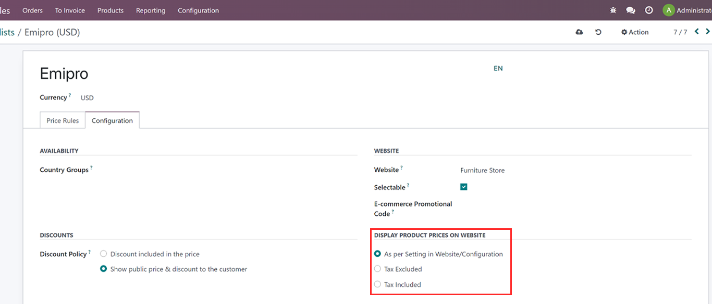

### Display Product Prices on the Website

* Use of this feature to display the Price on the product page using the Price List. Either Included Or Excluded tax according to the business. If B2B (Manufacturer and Wholesaler) no need to display the tax on the price on the product page. Because they will get back that amount from the government. But for B2C we need to display the Including tax.

**Configurations**

1. Go to Website App -> eCommerce -> click on Pricelists and click on the configuration Tab as per the below image.

2. You can select any of the options from DISPLAY PRODUCT PRICES ON WEBSITE

As per Setting in Website/Configuration: Default setting as per website configurations

Tax Excluded: Price will be tax excluded

Tax Included: Price will be tax included

