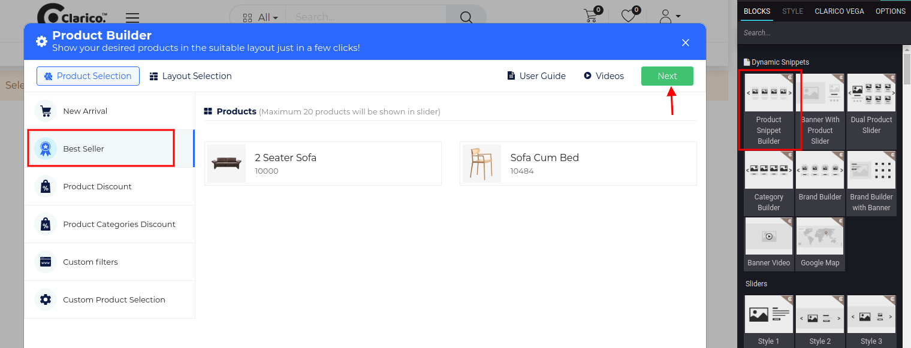
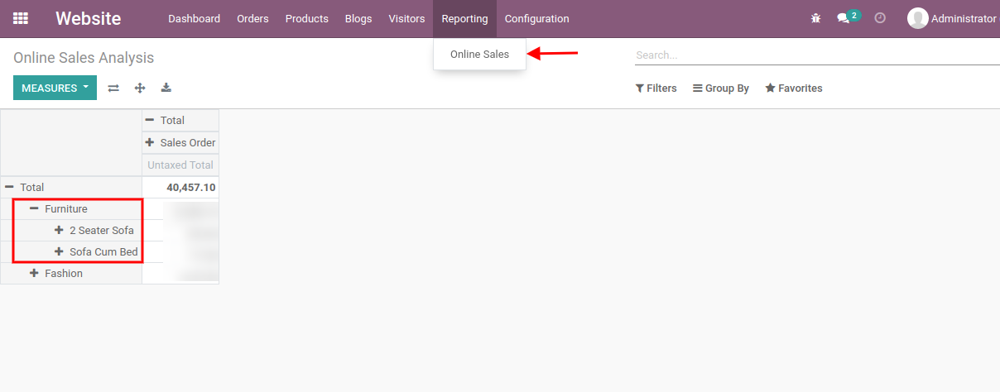

### Best Seller

To configure **Product Snippet Builder - Best Seller**, go to the webpage where you want to configure the slider. Click on the ‘Edit’ button from the top right & drop the Product Snippet Builder from the Dynamic Snippet portion and click on the Best Seller option as shown below screenshot.

All the Best Sellers product will be displayed there as per the above screenshot. Click on Next button for Layout Selection purpose. 

{:.alert-warning} 
> 
> #### NOTE
> 
> Layout Selection preview is same for all the styles of Product Snippet Builders ie. New Arrivals, Best Sellers, Product Discount, Product Categories Discount, Custom Filters, Custom Product Selection. Where you can configure UI/UX and Product Configuration. You can see the screenshot of Layout Selection in the New Arrival feature description.
> 
> 
> 

 

{:.alert-warning} 
> 
> #### NOTE
> 
> Best Sellers product will be considered from the Online Sales Reporting model as per the above screenshot.
> 
> 
> 

