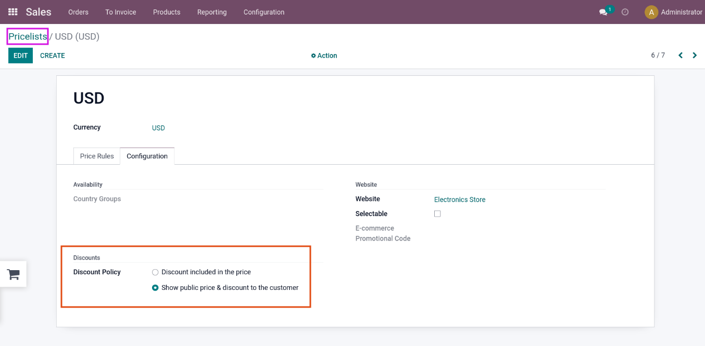

### FAQs

**1.How to show pricing amount and discount amount to the customer?**

- To show pricing amount and discount amount to the customer, you'll need to go to 'Sales App -> Products -> Pricelists -> Open respective pricelist -> Configuration tab -> Discount Policy -> Select Show public price & discount to the customer' and save the configuration.

**2.Getting server error 500 to any pages after update / apply the theme.**

- Please download the latest version of theme_clarico_vega and emipro_theme_base from the Your Odoo App Store.

Afterward, please follow the below instructions:

a. Copy the latest code from Odoo App Store using your registered email at the time of the Purchasing and unzip that module and put those modules into a custom module.
b. Restart the odoo services(Ignore if you are using Odoo.sh).
c. Upgrade the emipro theme base.
d. Update the theme for each website and check frontend functionality.

{:.alert-warning} 
> 
> #### NOTE
> 
> 
> 
> If you are using the on-premise server and after performing the 2nd step if you are not able to access the backend of your website  and you are getting then please upgrade the emipro_theme_base module using the below command.
> 
> 

/usr/bin/python3.6 /opt/custom_addons/odoo/odoo-bin -c /opt/custom_addons/conf/odoo.conf -u emipro_theme_base

Where
 - /usr/bin/python3.6 = Path of the python lib
 - /opt/custom_addons/odoo/odoo-bin -c => Path of the odoo-bin
 - opt/custom_addons/conf/odoo.conf => Path of your conf file
 - -u emipro_theme_base => Keep the module name as it is

So, once you will be done with this process everything works as expected. (As we have added few new fields in emipro_theme_base).

{:.alert-warning} 
> 
> #### NOTE
> 
> 
> 
> Make sure that above bin file path depend upon your addons/custom path.
> 
> 

**3. After theme getting installed, style and preview icons are missing in website editor.**

- There should be permission / rights related issues and due to that, images / icons are   not coming in the website editor. Please check it from your end regarding the same.

**4. In the page menu, the menu names are written several / multiple times in the title.**

- Please follow below mentioned steps to resolve the mentioned concern,
	a. Go to Odoo Backend (Enable the developer mode from Setting -> General Settings -> Scroll down until Developer Tools and click on Activate the developer mode, So by clicking on it it will enable that mode).
	b. Go Settings -> Technical -> User Interface -> Views.
	c. Search this text "theme_clarico_vega.submenu" as Search for Key Second option from the drop-down.
	d. Open that view and you can see action button on top side clicks on the button.
	e. There are 4 options, you need to click on "Compare/Reset" option and you can see one model popup with option "Reset mode" on top right side, select second option "Reset to file version (hard reset).", it will show compared code if any changes updated on it.
	f. Now click on "Reset View" button on bottom left side.
	g. Once above process done then you need to open front end website and delete all the menu items & create it new required menu items.