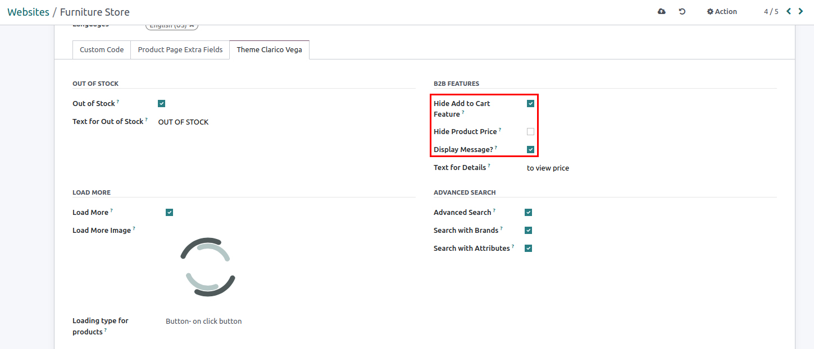
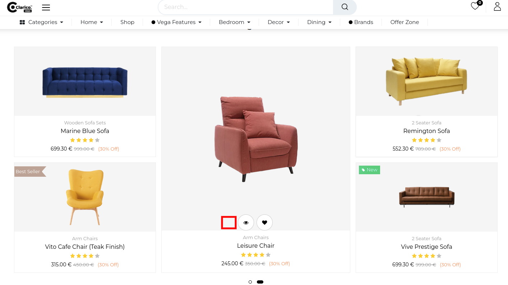
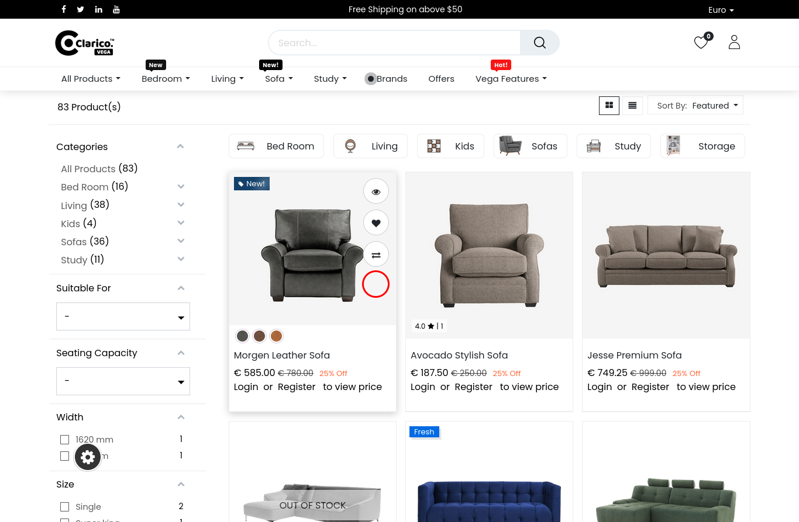
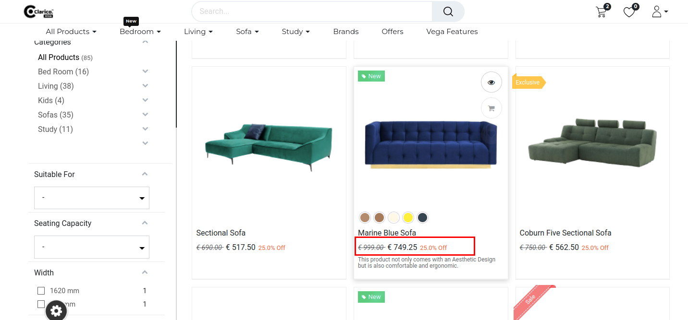
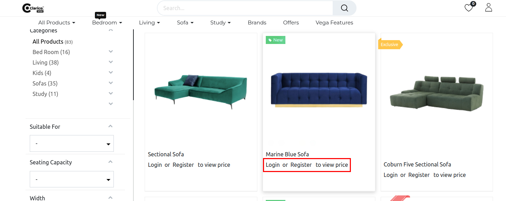

### Hide Add to Cart button & Price

Hide Price & Add to Cart allows you to control price visibility on any product & category page. You can hide the Price & Add to Cart button for Guest User, website-wise.

* To enable/disable Hide Add to Cart and Price, **website -> Configuration -> Settings -> Emipro Theme Settings Tab**

* There are 3 settings, as follows:
**Hide Add to Cart (B2B)**
* By enabling this feature it will hide the Add to cart button from Header, Dynamic Sliders, Shop, Product Page, Wishlist and Compare and Search bar and Search result Page.
* Before

* After

**Hide Product Price**
* By enabling this feature it will hide the Price from Header, Dynamic Sliders, Shop, Product Page, Wishlist and Compare and Search bar and Search result Page.

* Before

* After

**Display message**
* This message will display for the Guest user if this option is enabled otherwise there will be no message.
* Before

* After

