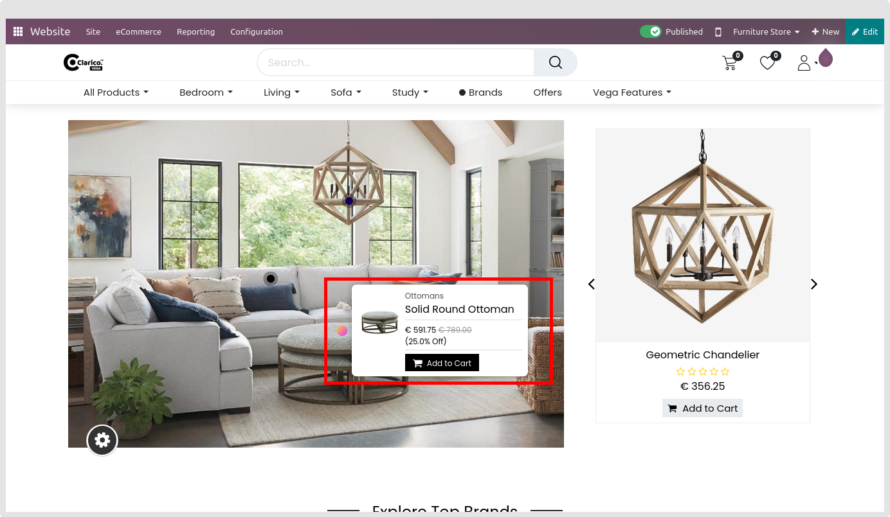
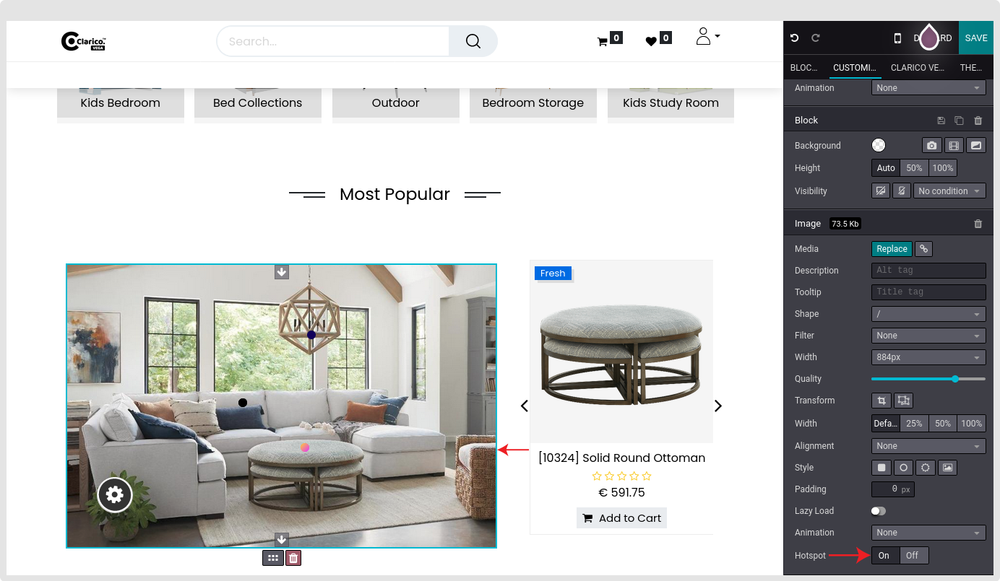
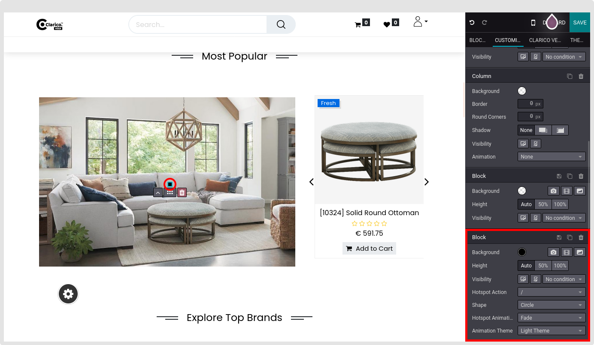
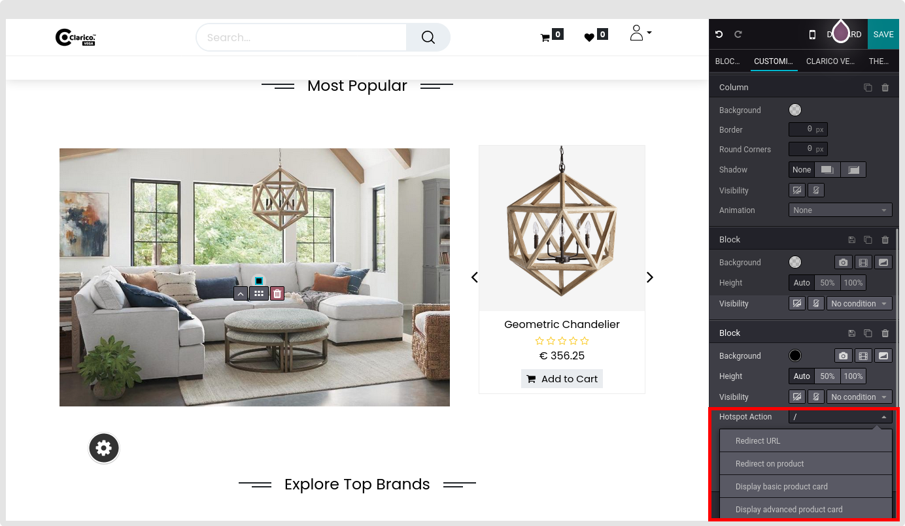
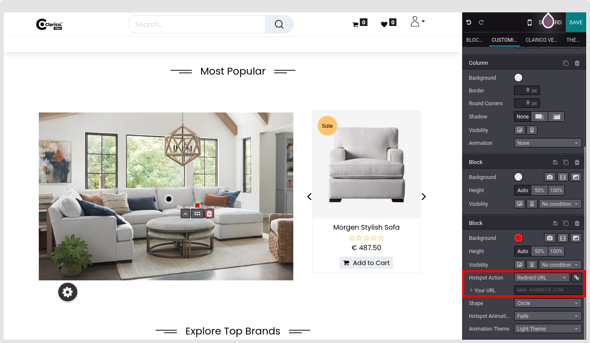
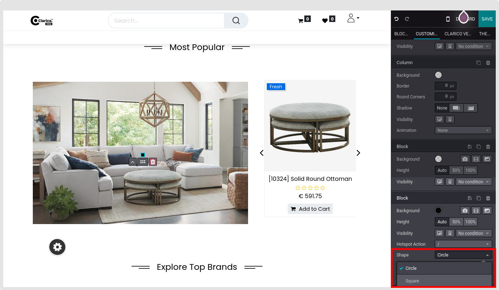
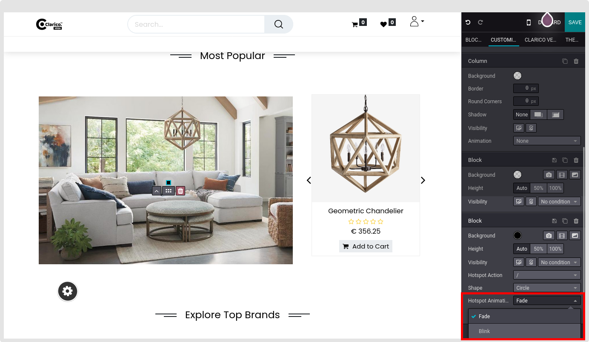
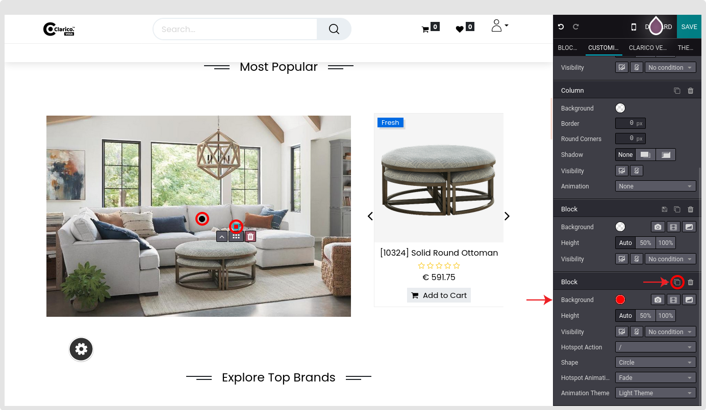

### Hotspot

Hotspot providing the functionality to showcasing the products section with various options to directly add to the cart. Also, provide an option to highlight the offers on a separate page.

To configure Hotspot - Go to the webpage where you want to configure the Hotspot. Click on the ‘Edit’ button from the top right & drop any below snippets as below:

Dynamic Snippets:
    - Banner With Product Slider
    - Product builder with banner
Sliders
    - Style 1
    - Style 2
    - Full Screen 2

* Choose any product image that you want in the respective snippet.
* After selecting that image, Toggle the Hotspot setting to On from the Editor options in the lower right corner.

* You can configure Hotspot settings like color, shape, animation, and hotspot action by clicking Hotspot in the image.

* **Hotspot Action Type:** Set any hotspot action from the drop-down selection per your need. Based on the selection the following input will display to configure the page URL or product.

**Hotspot Action**
<<<<<<< HEAD
	* **Redirect URL:** Your Url, Open in a new window(Toggle button)

	
	* **Redirect on the product:** Select any product you wish to display on the hotspot and enter the product URL in the following input field.
	* **Display basic product card:** Select any product you wish to display on the hotspot.
	* **Display advanced product card:** Select any product you wish to display on the hotspot.

* **Hotspot Color:** Set any color for the hotspot you wish to display.
* **Hotspot Shape:** Set any hotspot shape from the Editor options in the lower right corner to suit your overall theme layout.

* **Hotspot Animation:** Set hotspot animation between Fade and Blink.

=======

* **Redirect URL:** Your Url, Open in a new window(Toggle button)

* **Redirect on the product:** Select any product you wish to display on the hotspot and enter the product URL in the following input field.
* **Display basic product card:** Select any product you wish to display on the hotspot.
* **Display advanced product card:** Select any product you wish to display on the hotspot.

* **Hotspot Color:** Set any color for the hotspot you wish to display.
* **Hotspot Shape:** Set any hotspot shape from the Editor options in the lower right corner to suit your overall theme layout.

* **Hotspot Animation:** Set hotspot animation between Fade and Blink.

>>>>>>> 6835358fbab3db92f74eec8829c9c73ac3e94878
* By clicking the Hotspot and selecting the **Duplicate** symbol from the Editor options in the lower right corner, you may add as many Hotspots as you like based on your products in the image.

* A hotspot can be placed anywhere within the image.
* Finally, save your configuration by clicking the **Save button.** A Hotspot will appear on an image.

All the above settings will be displayed in the **Editor options.**