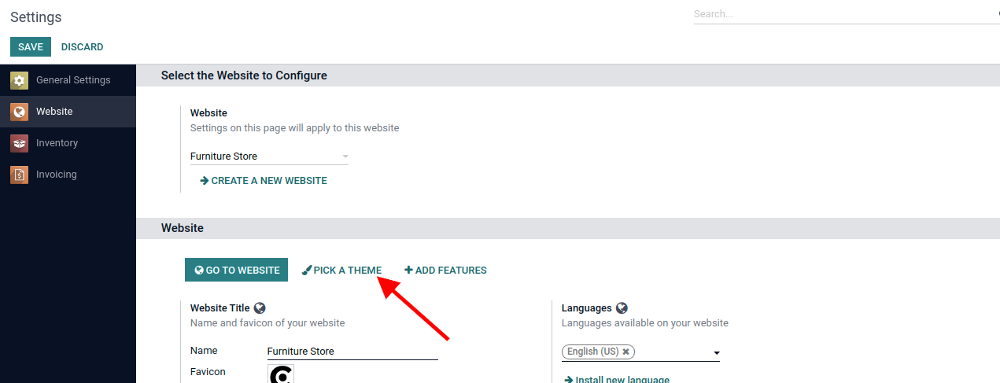
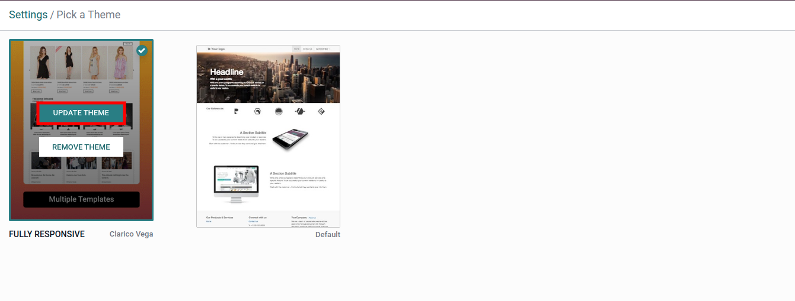

### Install & Update the Theme

Before installing the Theme Clarico Vega, make sure that you have downloaded the latest Odoo version as well as the latest version of Theme Clarico Vega along with its submodules.

**1. Install Theme**

After downloading the Theme Clarico Vega from the Odoo store, you will get the multiple folders and there is one folder named "theme\_clarico\_vega". It's a theme folder and other folders are dependent modules.

Add all of the folders in your addons directory and restart the Odoo server and update your app list from the ‘Apps’ menu from the admin view.

  

Now go to **Website / Configuration / Settings**. In Website settings, select a website in which you want to install Theme Clarico Vega, click on the **PICK A THEME** button. You will be redirected to the list of available themes. Click on **Theme Clarico Vega** to Install it on your website.

**2. Update The Clarico Vega** 

To update the latest version of the theme, First, download it from Odoo Store and replace it with your existing Theme source code. There can be two scenarios for updating Theme features.

**a) Changes Into Emipro Theme Base:** These modules contain business logic and functional elements for all Emipro eCommerce themes in Odoo V15. So if there are any changes in business logic, then you need to mandatory upgrade the "Emipro Theme Base" module.

**b) Changes Into Theme Clarico Vega:** ‘Theme Clarico Vega’ contains UI elements. So if there are any updates related to UI or template then you need to upgrade the Theme. For that, navigate to **Website / Configuration / Settings** and select the website and click on **PICK A THEME** then update the theme.

 

{:.alert-warning} 
> 
> #### NOTE
> 
> **Technical Steps to Install/Update Theme Clarico Vega:**
> 
> 
> 1. Copy and paste theme\_clarico\_vega and emipro\_theme\_base code into your custom module (Add/Replace).  
> 
> 2. Restart the odoo services. (Ignore if you are using Odoo.sh)  
> 
> 3. Go to Apps -> Update List (Please start debug mode first otherwise it will not show this menu).  
> 
> 4. Find emipro\_theme\_base module & Install/Upgrade that module.  
> 
> 5. Install/Update a theme Clarico Vega from Website Configuration.
> 
> 
> 

 

