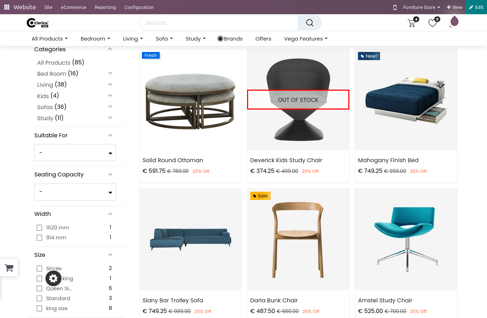

### Out Of Stock Label

* This Feature will display labels when you don’t have product quantity available in your warehouse for the given website.

{:.alert-warning} 
> 
> #### NOTE
> 
> **This feature will only work on a storable product in which Out-of-Stock option is unchecked**
> **Out of stock will be displayed in following pages: Shop Page Grid view and List View, Dynamic Product Sliders, Compare Page, Wishlist Page**
> 

* After that, you will be able to enter a text that you want to display if the product is not in stock.

* You can also able to do the translation of that text by clicking on the language short code.

* The message will appear on the image of the particular product in which there is no quantity available.

