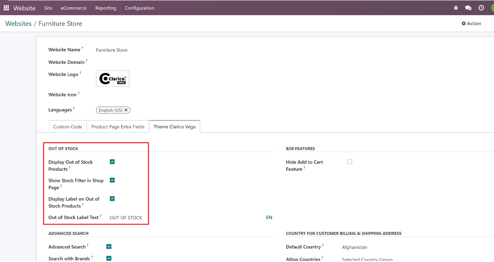
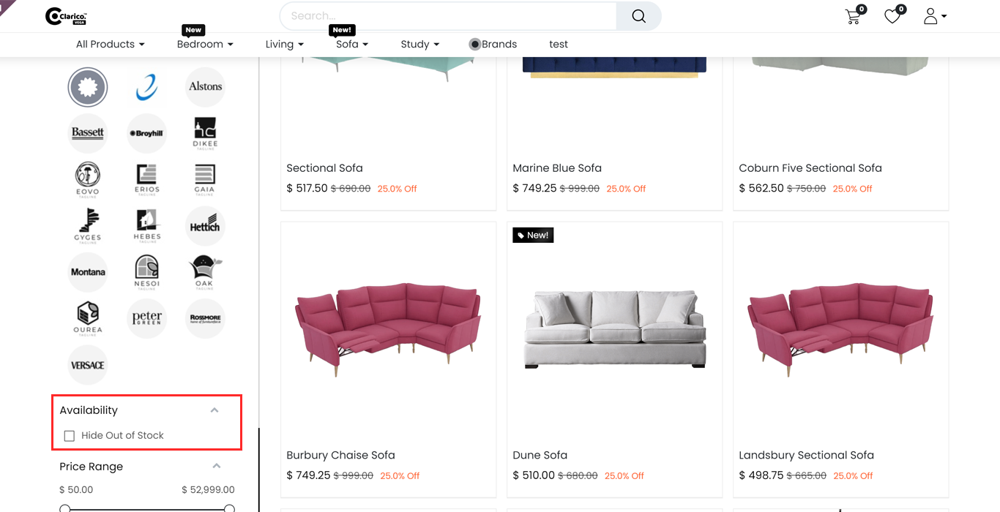

### Out Of Stock

* Using the Out of stock feature users can disable the out-of-stock products from the Dynamic Product Snippet, Search result, Shop page, Suggested Accessories, Available Options, and Alternative Products.

**Configurations**

**Display Out of Stock Products**

1. Go to Website App -> Configurations -> websites and click on Theme Clarico Vega Tab and select any website and go to the OUT OF STOCK section.

2. Enable this option to Display Out of Stock Products and then verify on the shop page.

**Show Stock Filter on Shop Page**

1. Go to Website App -> Configurations -> websites and select any website and click on Theme Clarico Vega Tab and go to Show Stock Filter in the Shop Page section.
2. Enable this option Show Stock Filter on Shop Page and it will display the Availability filter on the shop page.

