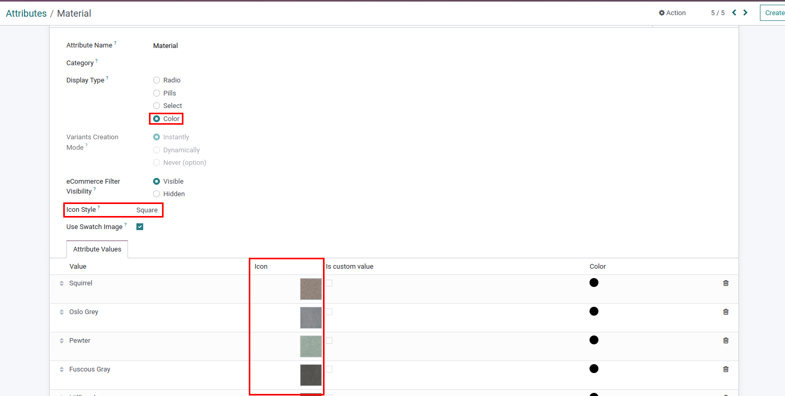

### Attribute Swatches with Tooltip

* Swatches are the feature that allows for presenting product options by displaying the corresponding visual representation inside the Attribute Listing itself. They grab the customers’ attention and shape their decision-making behaviors.
* **Configuration of Swatches:** In order to configure the Swatches, go to Attributes in the Backend and open the record of Attribute. Upload the Icon image as pe the the below screenshot & save the changes.

 

{:.alert-warning} 
> 
> #### NOTE
> 
> 1. Need to set the Attribute Display type as a Color in order to display the swatches.
> 2. You can also set the icon/swatches style from the same configuration as shown as the above screenshot.
> 3. Please visit this link to check the real time usage of this feature: [Avocado Stylish Sofa](https://claricovega.theme14demo.emiprotechnologies.com/shop/avocado-stylish-sofa-110)
> 
> 
> 

 

