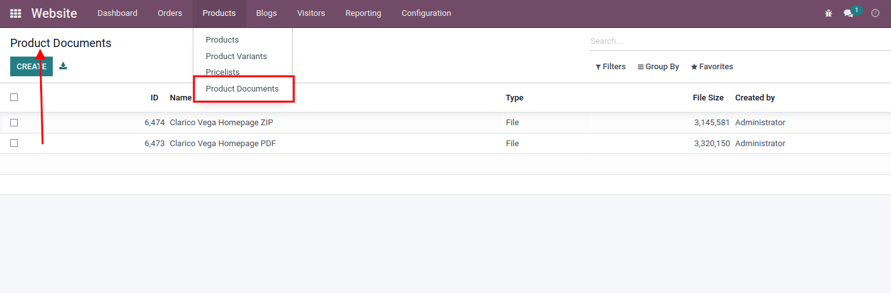
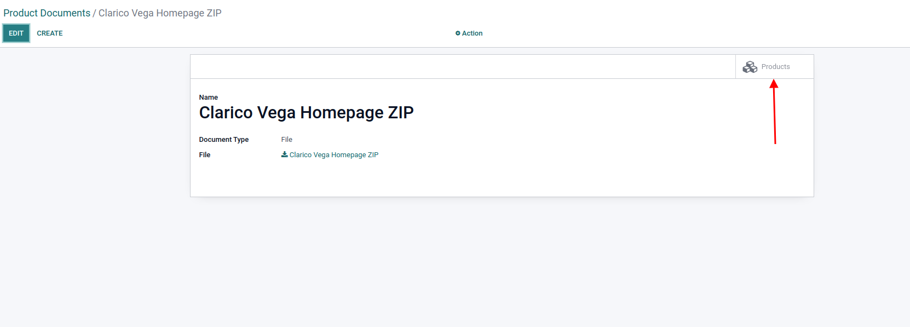
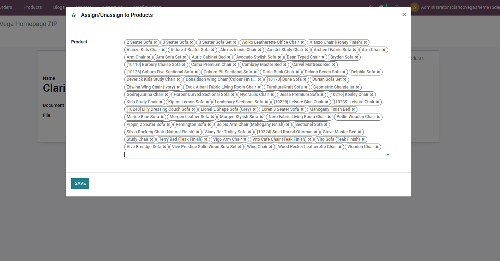
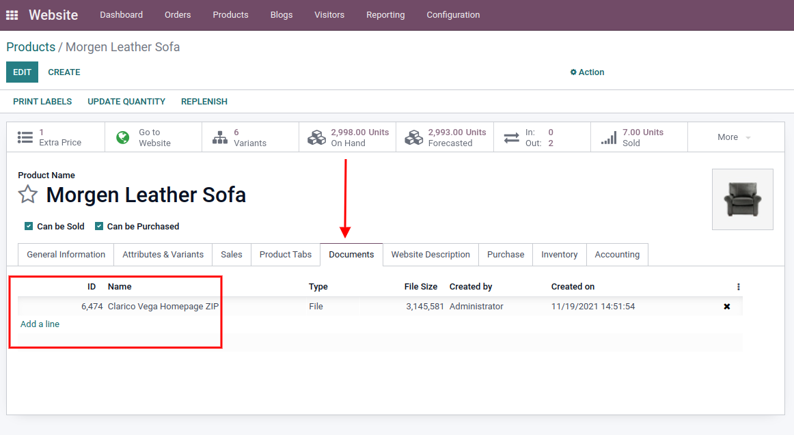
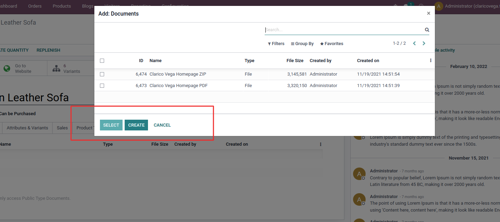
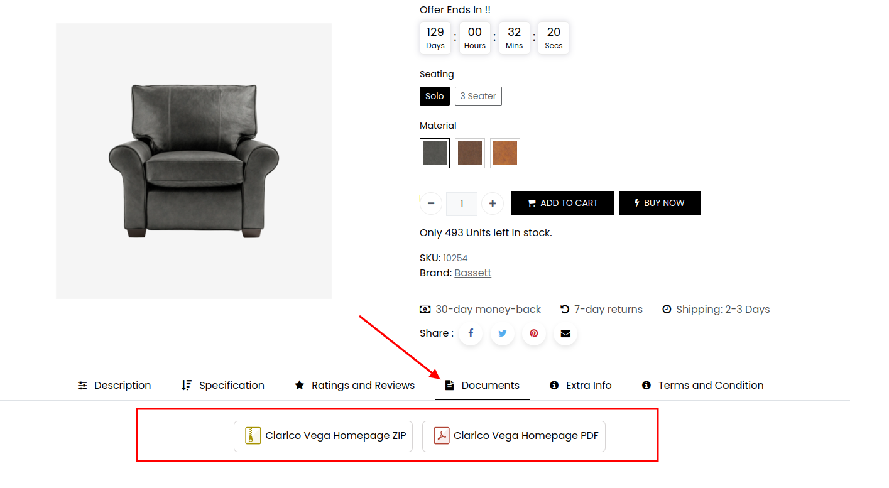

### Documentation Tab

<iframe width="560" height="315" src="https://www.youtube.com/embed/uJ1W7LlKWJo" title="YouTube video player" frameborder="0" allow="accelerometer; autoplay; clipboard-write; encrypted-media; gyroscope; picture-in-picture" allowfullscreen></iframe>

Admin can add multiple documents like terms & conditions or a user guide in desired file format and assign them to all products globally.

This feature allows you to provide the below-listed functionality to your customer on the Product page:

1. Customers can download any type of document
2. Customers can navigate to any Internal or External Link

* **Step 1:** Go to Website > Products > Product Documents where you can see the list of documents as per the below screenshot. From that view, you can create a new document by uploading a file or a URL.

* **Step 2:** Open any document, You can see the smart button at the top right of the form view named **Products**. Once you click on that button, one wizard will be displayed where you can select single or multiple products and click on the Save button.

* **Step 3:** Once you save this change, the document will be assigned to all the selected products. Also, you can do the same process inside the Product form view.

**When we click on Add line below wizard will be open.**

**After the completion of this process, you can see the documents on the product page as below.**

