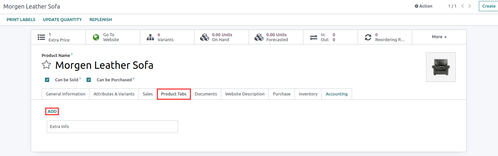
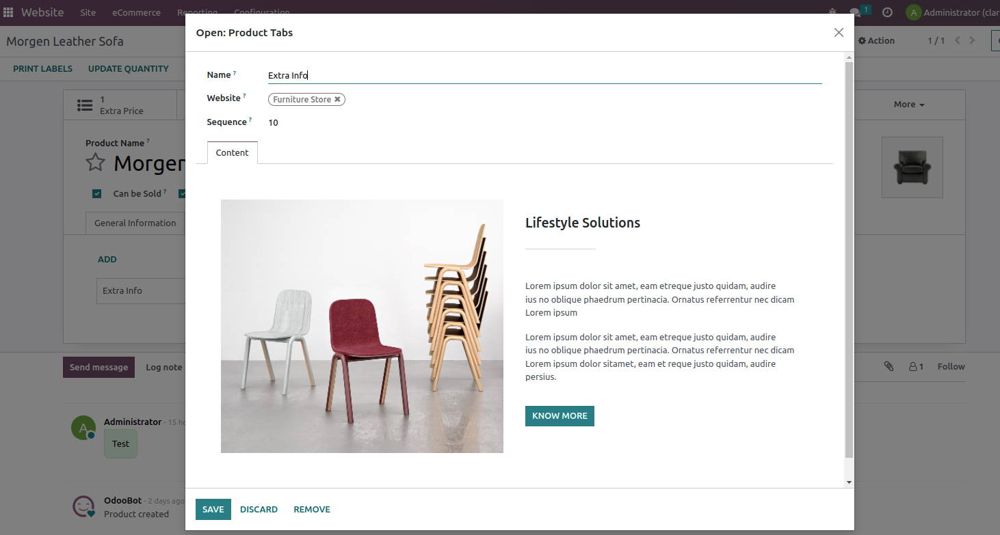
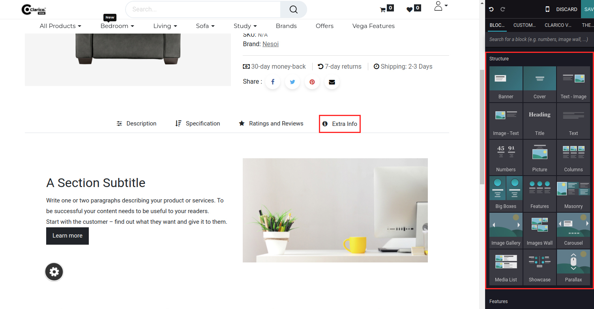
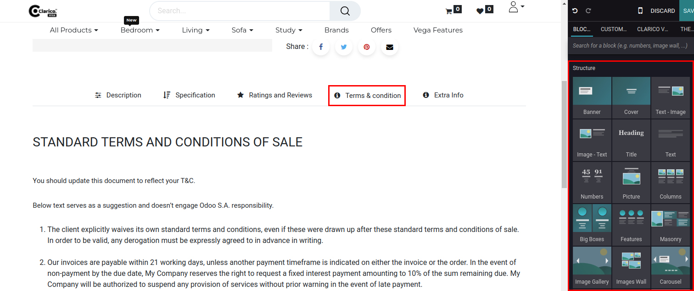
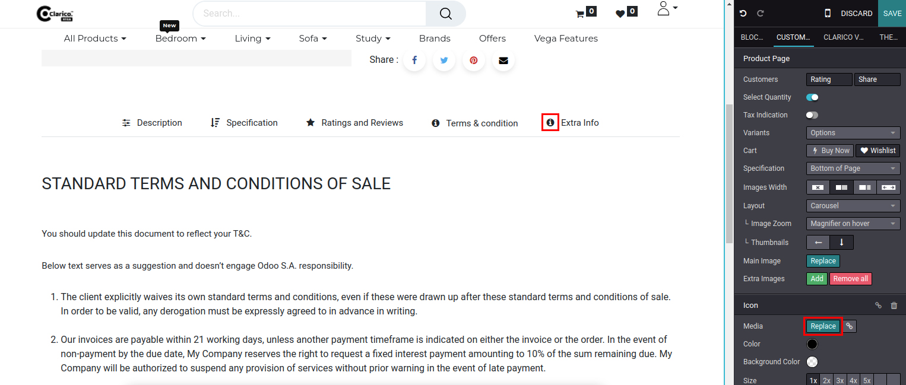
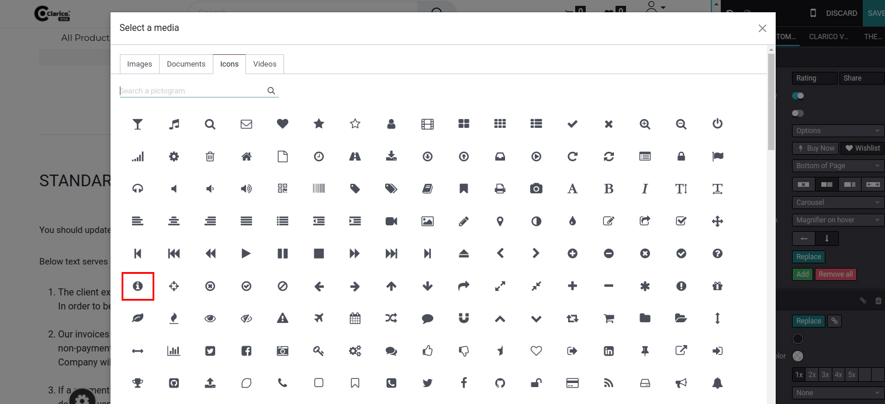
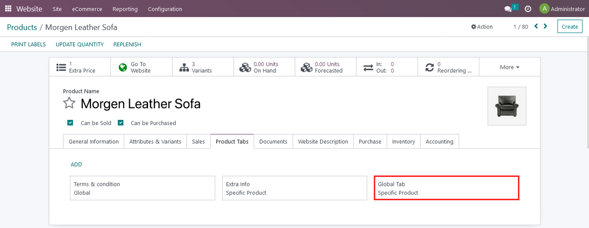
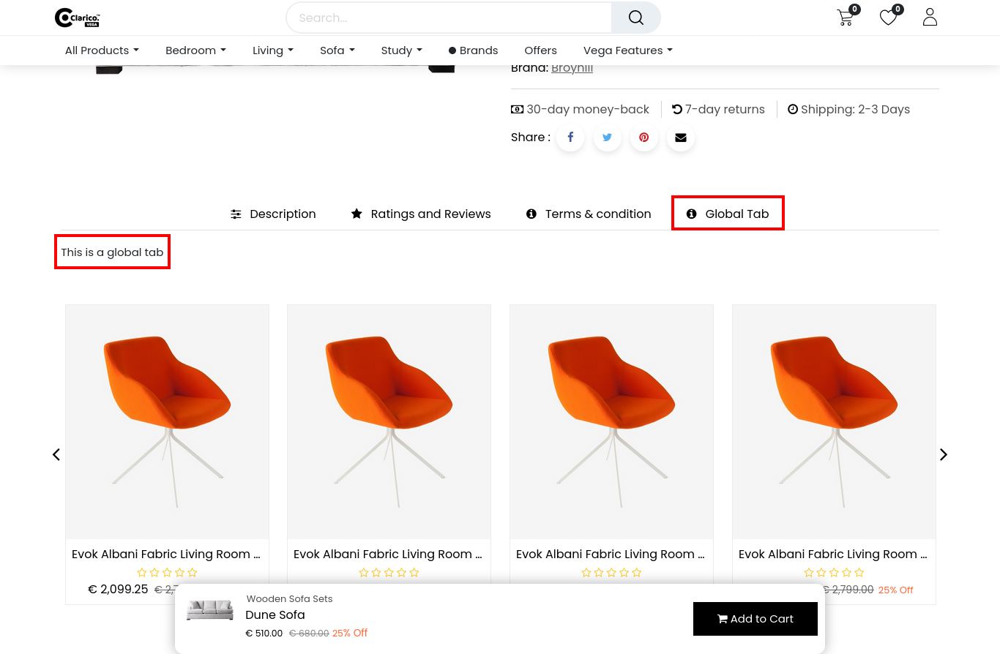

### Dynamic Product Tabs

<iframe width="560" height="315" src="https://www.youtube.com/embed/TcgMXLzyAPg" title="YouTube video player" frameborder="0" allow="accelerometer; autoplay; clipboard-write; encrypted-media; gyroscope; picture-in-picture" allowfullscreen></iframe>

With this feature, you can create multiple tabs on a product page. A product tab section can be designed wisely to display smart product tabs.

Tabs can be configured in two ways
1. Product Specific
2. Global tabs
3. Global Tab Product Specific

#### 1. Product Specific

Steps to configure Product Specific tabs:

* **Step 1:** Go to the Product backend of a particular product where you want to add the extra tab.

* **Step 2:** Go to the Product tab option and click on edit. You will find the Add link. By clicking on the Add link Create Product Tabs popup will appear. Specify the Tab name and Content. In content, you can add Html content from the back-end or you can drag snippets from the front-end as well.

{:.alert-warning}
>#### Note
> If a website is not selected while creating a tab, It will be visible for every website in which the theme is installed.rights to the editor, it will not be visible to the guest or portal users.
>

#### 2. Global Tabs

Steps to configure Dynamic global product tabs:

* **Step 1:** Go to the Website -> eCommerce -> Products -> Product tabs
* **Step 2:** Create a Product Tab. Specify the Tab name and Content. In content, you can add Html content from the back-end or you can drag snippets from the front-end as well.

{:.alert-warning}
>#### Note
> - If a website is not selected while creating a tab, It will be visible for every website in which the theme is installed.
> - You can publish a tab after configuring it from your end. If it is unpublished, it will be visible only to admin users who have rights to the editor, it will not be visible to the guest or portal users.
>

* **Step 3:** Publish a tab after set up properly

* **Step 4:** You can change the icon for a particular tab from the front-end which will be applicable for all product pages globally.

For that, click on the icon and select media from the editor to choose the appropriate icon for that particular product tab.

#### 3. Global Tab Product Specific

Steps to configure Global tab product specific:

* **Step 1:** Follow the same steps as per Global Tabs
* **Step 2:** Go to the Product backend of a particular product where you want to add the global tab product specific tab.

* **Step 3:** Add/update content as per your need.

