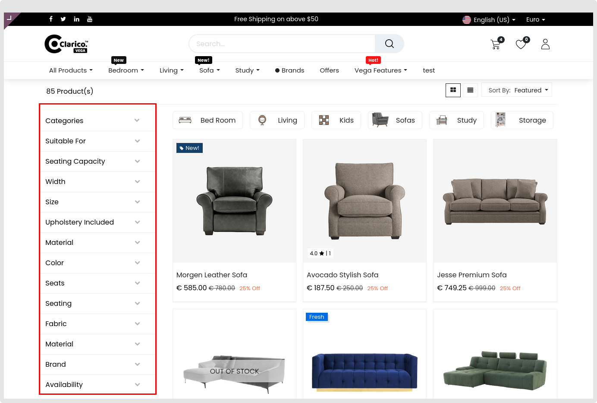
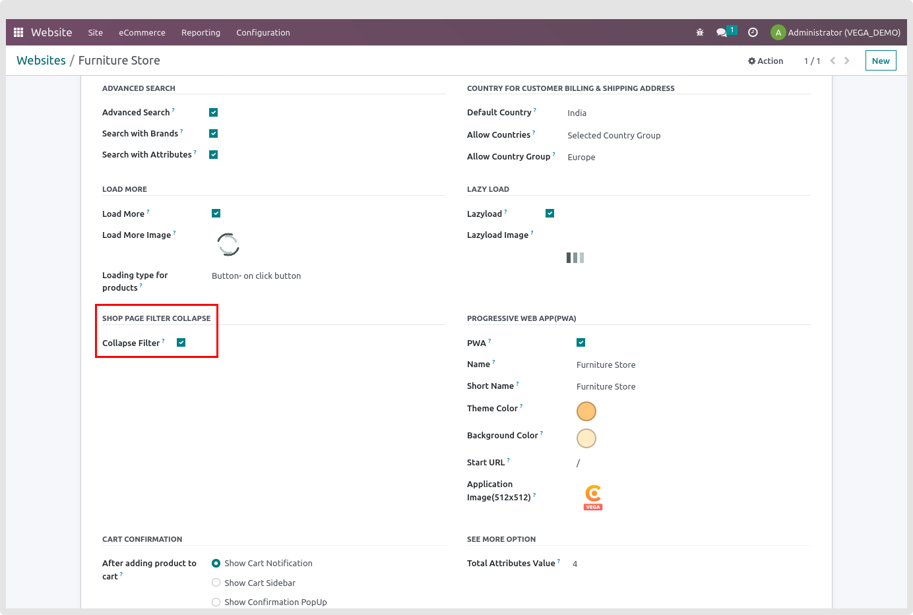

### Collapse Filter

Filters on the shop page can take up large amounts of screen space restricting the data that can be displayed. You can mitigate this by collapsing the filters when you are not altering them. You can expand them again when you want to change them.

To enable/disable the Collapse Filter option, website -> Configuration -> Settings -> Emipro Theme Settings Tab.

By enabling this feature it will collapse all attribute filters on the shop page.

