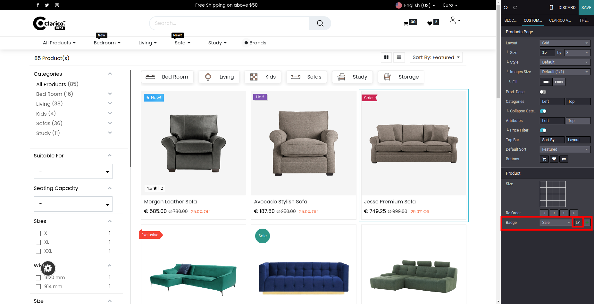
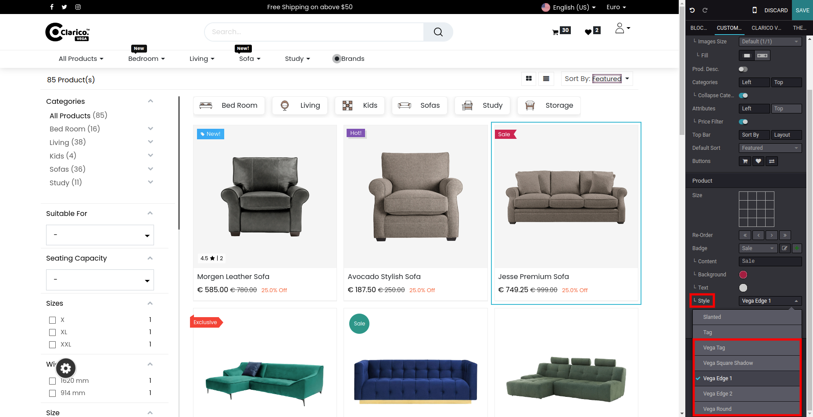
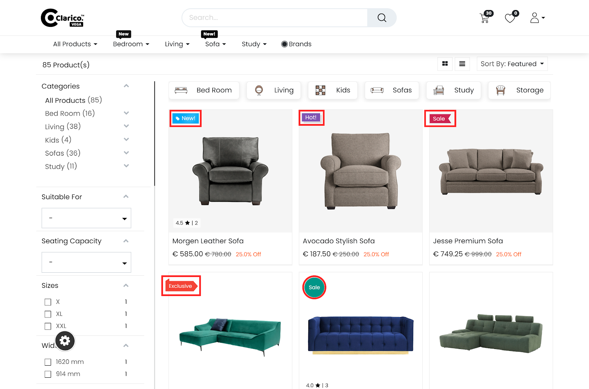

### Product Ribbons Design

* **Step 1:** To Apply Product Ribbons, open Website Editor from the Website & click on product in which you want to add the ribbon. Under Product -> Badge -> Edit

* **Step 2:** Add content and click on the style where we provided 3 different styles.

* **Step 3:** Click save and apply the changes.

{:.alert-warning} 
> 
> #### NOTE
> 
> You can configure it from backend
> 

