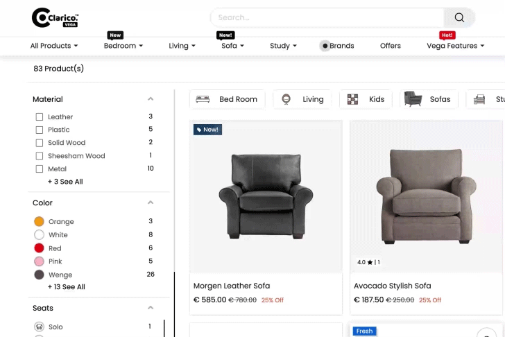
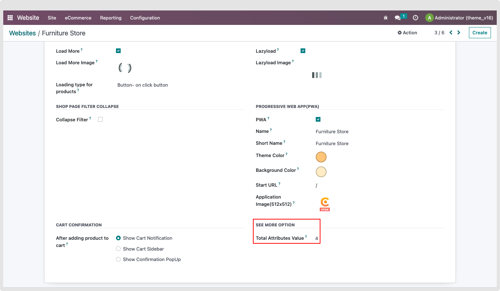

### See All

In order to enhance the speed of the website shop page, we have introduced a feature called 'See All'.

It will load up to five attribute values into the product attribute filter. A user can view all attribute values by clicking on the See All button if there are more than five attribute values.

To enable/disable the option, website -> Configuration -> Settings -> Emipro Theme Settings Tab. There is an option for users to select up to five attribute values to be displayed on the shop page

