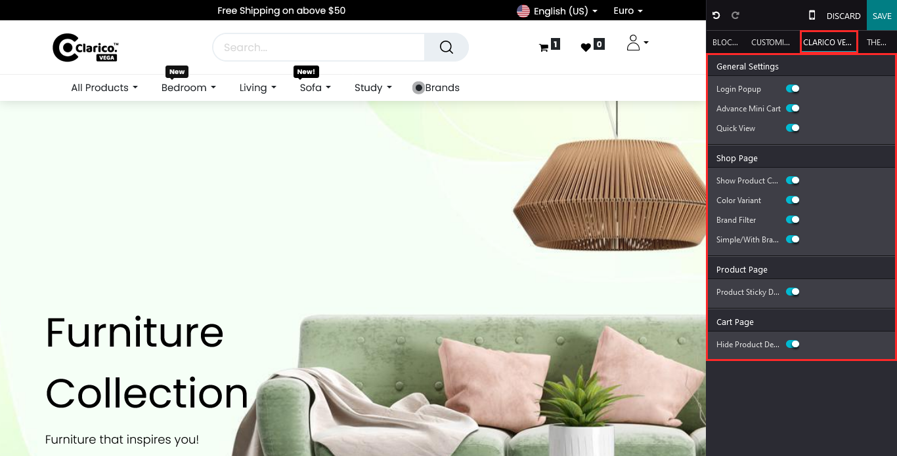
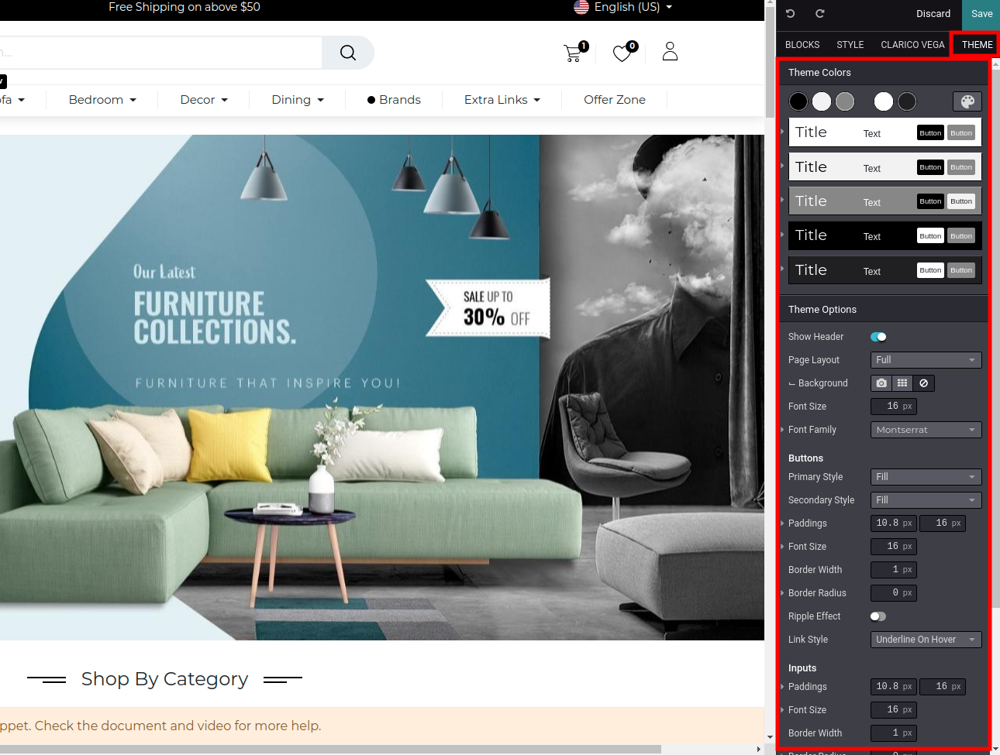

### Theme Customize

In the theme customize section, you can manage colours, layout, navbar, fonts and other theme-related configurations. Go to the website & open Web Editor. Where you see the number of tabs with different configurations.

As per the above screenshot, in the Clarico Vega tab, you can see all the theme features configuration options.

As per the above screenshot, in the Option tab, you can see all the default theme features.

