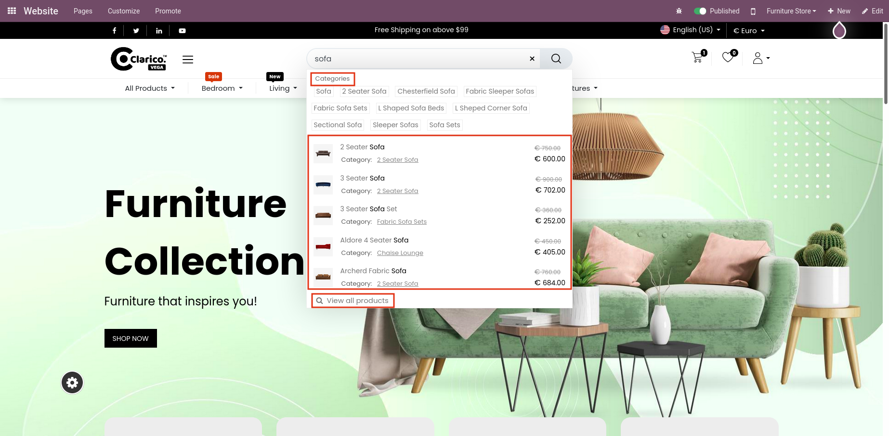
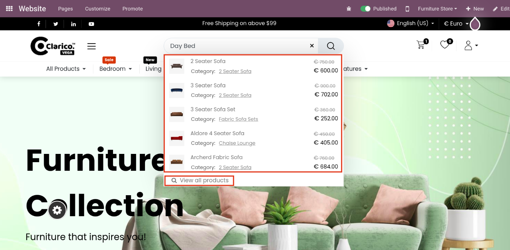
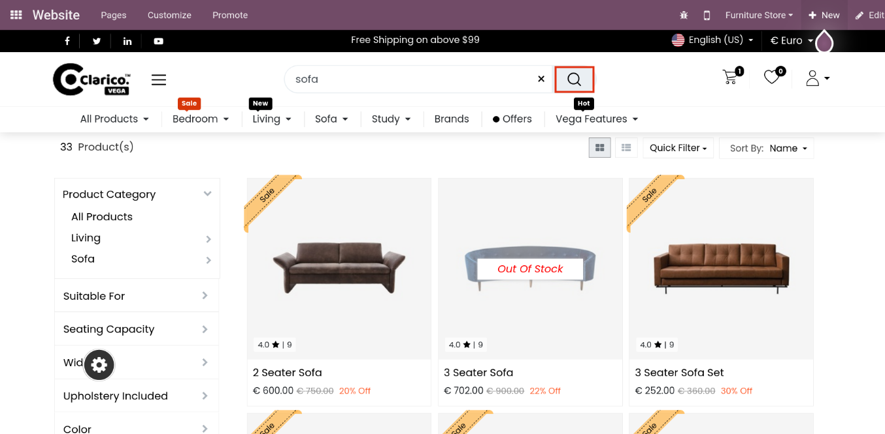
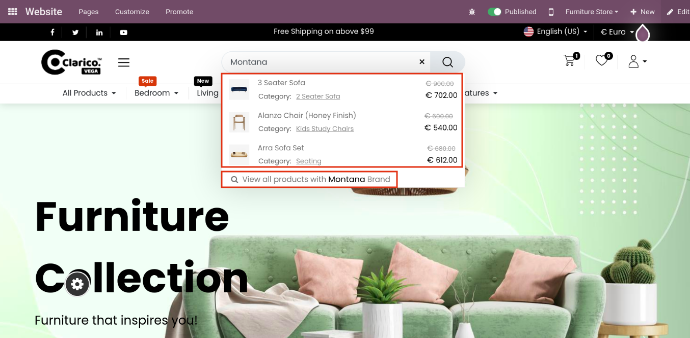
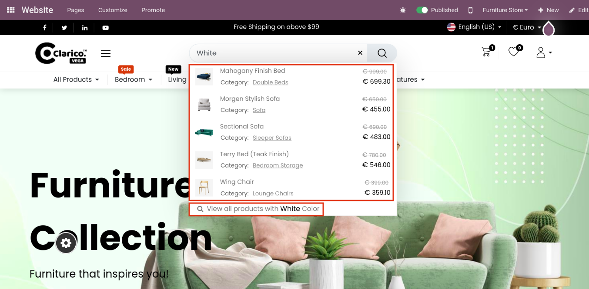

### Advanced Search

Advanced Search makes searching of products, product categories, etc. in e-commerce easier by providing search results as dropdown while typing on search bar. By using this advanced search, users can get the search results in more effective and efficient manner.

* To visit respective website, go to **Website App -> Configuration -> Settings**. Select respective website and then click on **Go To Website**
* It will display front-end of that selected website
* Type relevant word to search the same on the website. As per the entered word, the search result will be displayed in three sections: **Categories, Products List, View All Products**

* If you can search with synonym of **Sofa** that we have added in our **Search Synonyms Groups** then it will going to show you the same kind of search result (i.e. with Products List and View All Products)

* You can click on any individual category, product or view all products

* You can also click on **Search** icon or hit **Enter** button from your keyboard to perform search operation and view the search results

* If you have enabled **Search by Brands** in configuration, then you can also user relevant brand word to perform the search operation on the website

* If you have enabled **Search by Attributes** in configuration, then you can also user relevant attributes word to perform the search operation on the website

You can click on given **Cross** icon to remove the entered word from the search box
