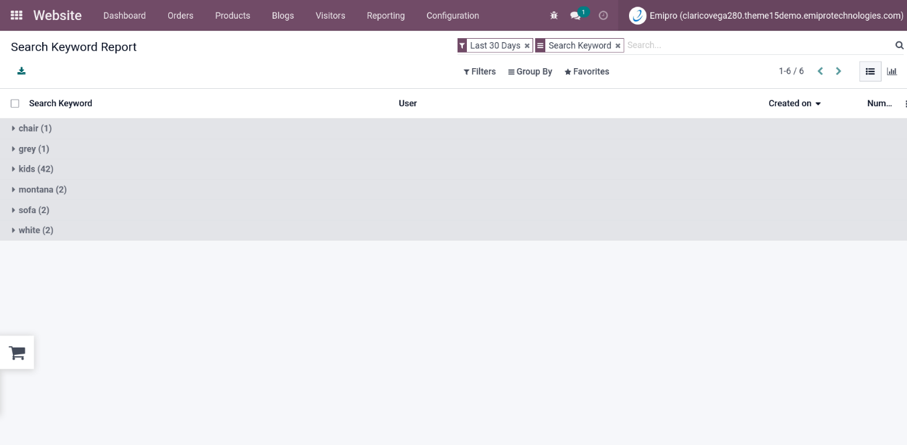
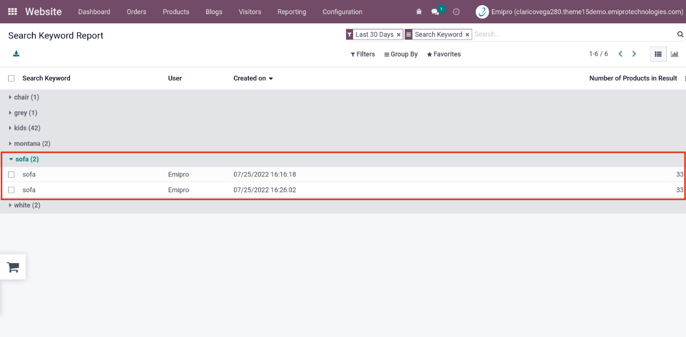
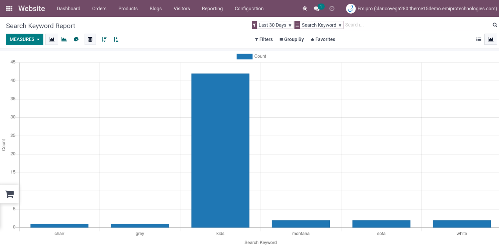

### Search Keyword Report

*  This report is useful for administrator user to view / check the keywords (along with the numbers of search) used by website visitor users to perform search operation
*  To view report, go to **Website App -> Reporting -> Search Keyword Report**
*  It will display all the search keywords list (along with the numbers of search) used by the website visitor users to search on the website

* By clicking on any of the search keyword, it will expand and provide you the individual details (i.e. Keyword Name, User, Created on, Number of Products in Results) regarding that particular search keyword

*  Administrator user can also able to view the graphical representation of this report
