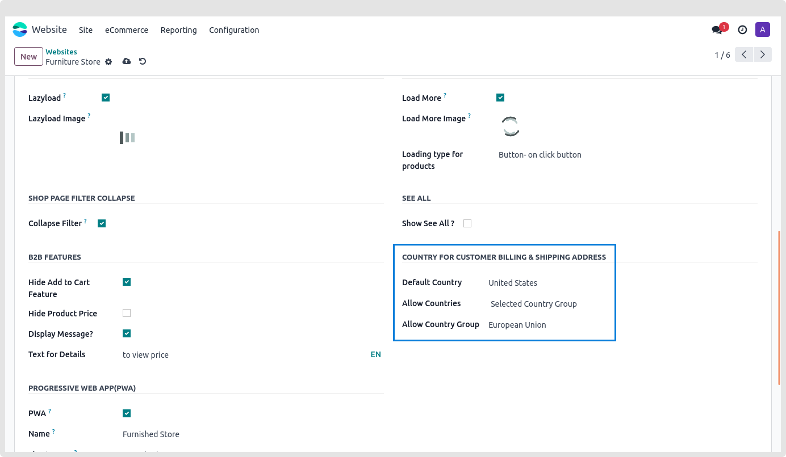
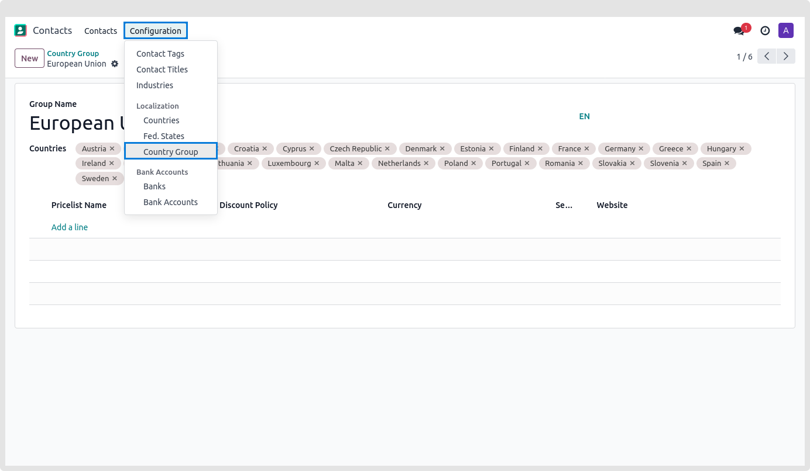
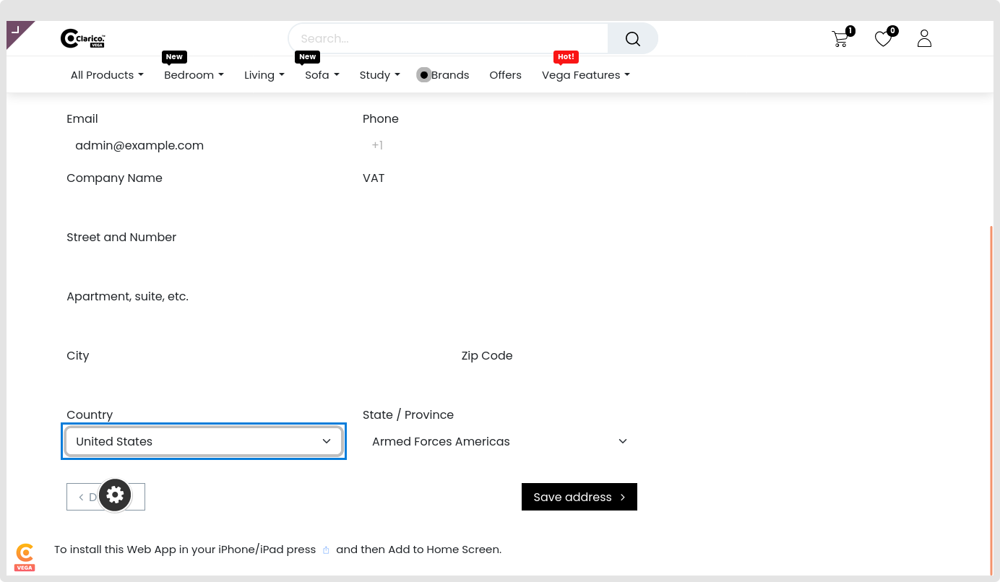

### Allow selected countries for order checkout

* Permit orders from a certain nation group solely in accordance with your company demands.

**Configurations**

1. Locate the COUNTRY FOR CUSTOMER BILLING & SHIPPING ADDRESS area by going to Website App -> Configurations -> websites, selecting any website, and then clicking on the Theme Clarico Vega Tab.

2. Default Country: The country selection pop-up, which is also the default country, allows the user to pick the default nation.

3. Allow Countries: Here, the dropdown menu's single selections are available for selection. Every nation or some nations. Therefore, fields labeled "Allow Country Group" where you may choose the country group will appear when the user picks the Selected Country Group.

**Methods for Establishing a Country Group**

1.Select Contacts App -> Configuration -> Localization -> Click on Country Group

2.A new nation group can be edited or added here.

3.Enter the name of the new group, choose the nation you want to add, and then click Save after you're done establishing the new country group.

4. After completing the aforementioned setup, click "Save" and check this functionality on any address page.

