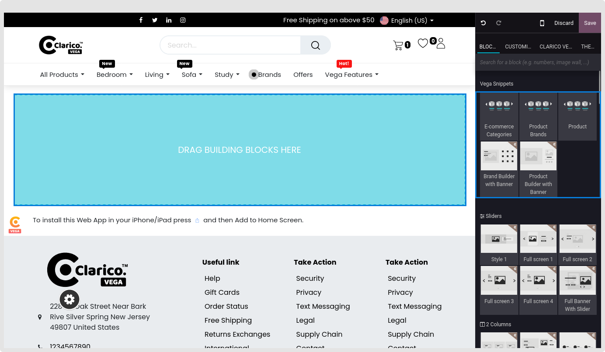

### eCommerce Category Builder

* It is possible to display the eCommerce categories using this dynamic snippet.

**Configurations**

1. Navigate to the webpage where you wish to adjust the slider in order to set E-commerce Category Builder. To drop the Category snippet from the Dynamic Content section, click the 'Edit' button located at the top right of the screen, as seen in the figure below.

2.After dropping the snippet, the various options will appear below.

Visibility: This sample can be hidden for desktop or mobile viewing, depending on the circumstances.
Category: CSelect the name of the category using the search bar. The category will appear above this choice when you pick it. You may then delete the category from there.
Template: A variety of snippet styles are available for selection.
Fetched Elements: the records you intended to display.
Slider Speed: Adjust the dragging speed.

{:.alert-warning} 
> 
> #### NOTE
> 
> **By default, it will display Max 16 brand in the slider.**
> 

