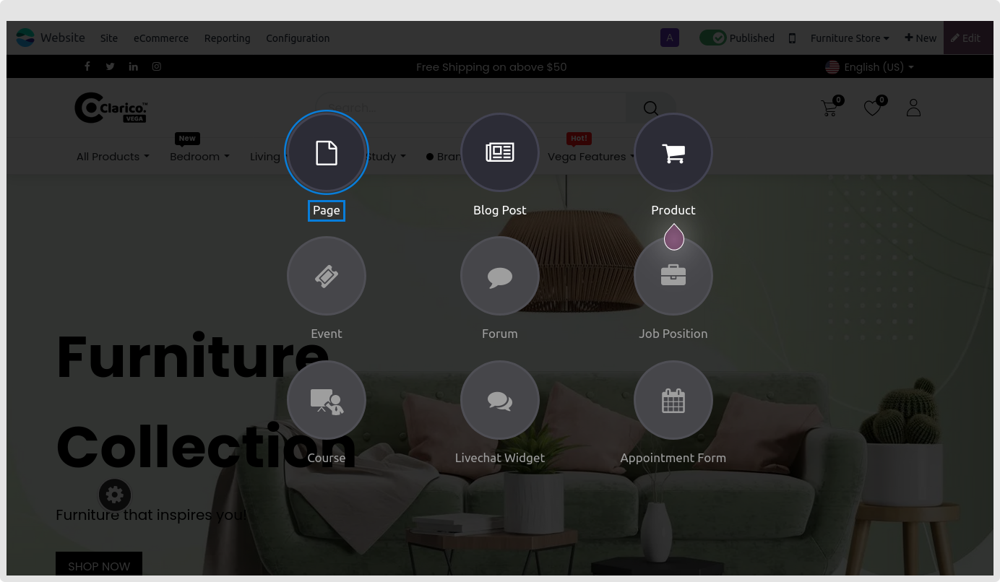
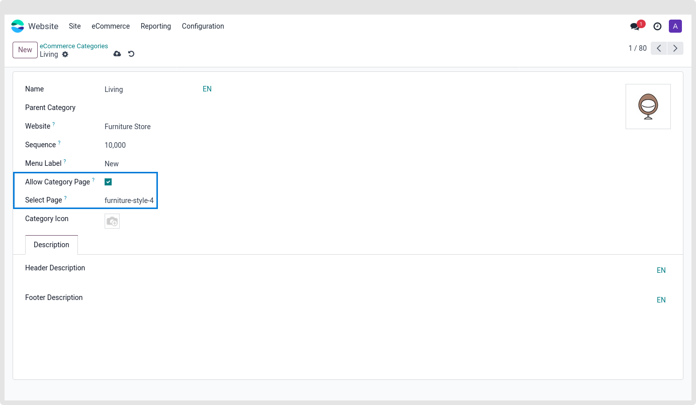

### Category Landing Page

This feature utilised show the landing page for a certain category. You may easily create some visually stunning webpages and classify them right away with our snippets. When customers click on Category from the Category Slider at that precise moment, they will be sent to that specific category landing page. This is the place to display CMS blocks, deals, merchandise, and other stuff related to your category.

This feature allows you to examine the landing page for a certain category. With these snippets, you can easily produce some interesting webpages and immediately classify them under the appropriate category.

Clicking Category Slider will take them to that particular category landing page, where you may show CMS blocks about your brand, deals, items, etc.

How to Set Up an Entire Category Landing Page:

* **Step 1:** Go to the page and select the recently added button in the upper right-hand corner. A pop-up box requesting the page title will appear when you choose the **New page** option. Click the "Continue" button after that.

* **Step 2:** The redirect will end up on the particular page that you created. Drag and drop snippets into a page, then save it to add them.
* **Step 3:** Select the category record that you want to use as the Category Landing page for the newly created page by navigating to the **Website / Configuration / Product / eCommerce Categories** backend.

As seen in the picture above, allow Category Page and specify the name of the page you created in the preceding screenshot. Go to the page where the Category Slider is configured. Clicking on that category will take you to the Category Landing page rather than the Shop page.

