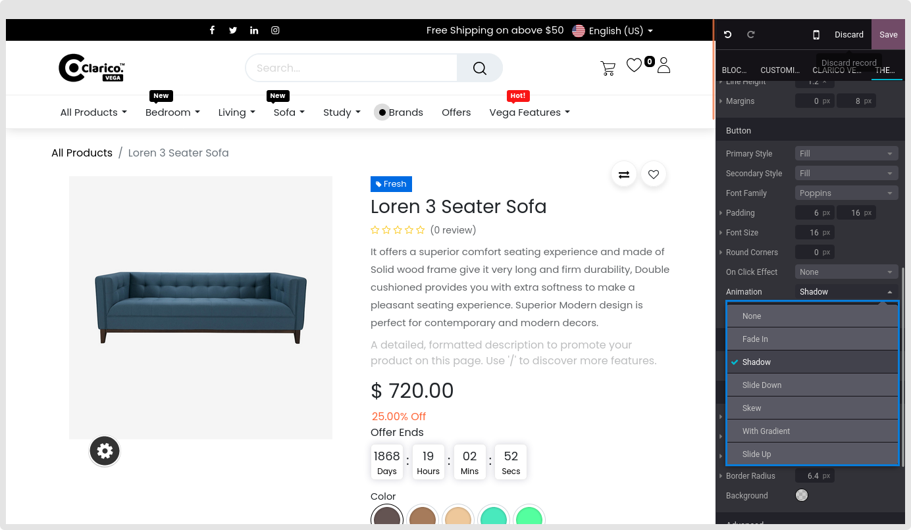
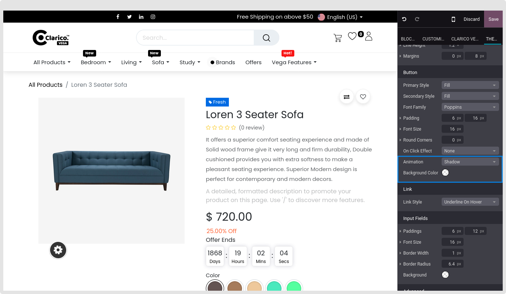

### Change Button Style

* Open Website Editor from the website and select the Clarico Vega option, as seen in the screenshot below, to alter the button's look. You may select the desired button style by using the Choose Button Style option, then save your modifications.

