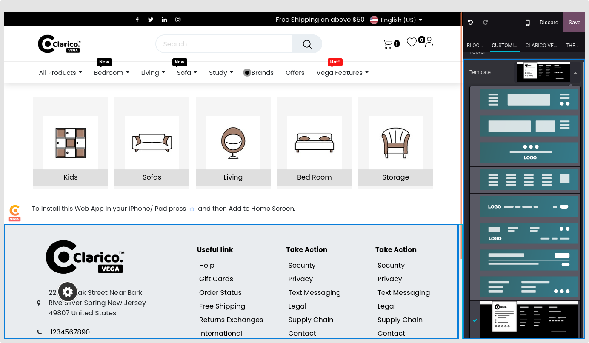

### Change Footer Style

* To change the footer style, open Website Editor from the Website & click on the Footer portion. When you choose the footer, the screenshot below displays the dropdown menu with the available footer options. Select the appropriate theme footer and save the changes.

