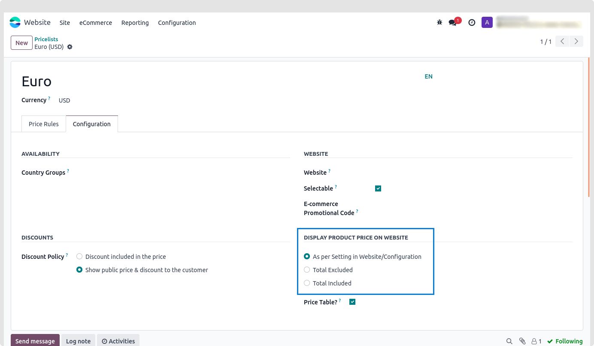

### Display Product Prices on the Website

* Making use of this functionality to use the Price List to display the Price on the product page. Depending on the type of business, either included or excluded tax. Manufacturers and wholesalers do not have to show the tax on the product page's pricing if they are B2B. as the government will reimburse them for that sum. However, we must provide the Including tax for B2C.

**Configurations**

1. Navigate to eCommerce -> Website App. In accordance with the illustration below, click Pricelists and then the Configuration Tab.

2. Any option under DISPLAY PRODUCT PRICES ON WEBSITE is available for selection.

According to the Website/Configuration Setting: default setup according to the website

Tax Excluded: Price will be tax excluded

Tax Included: Price will be tax included

