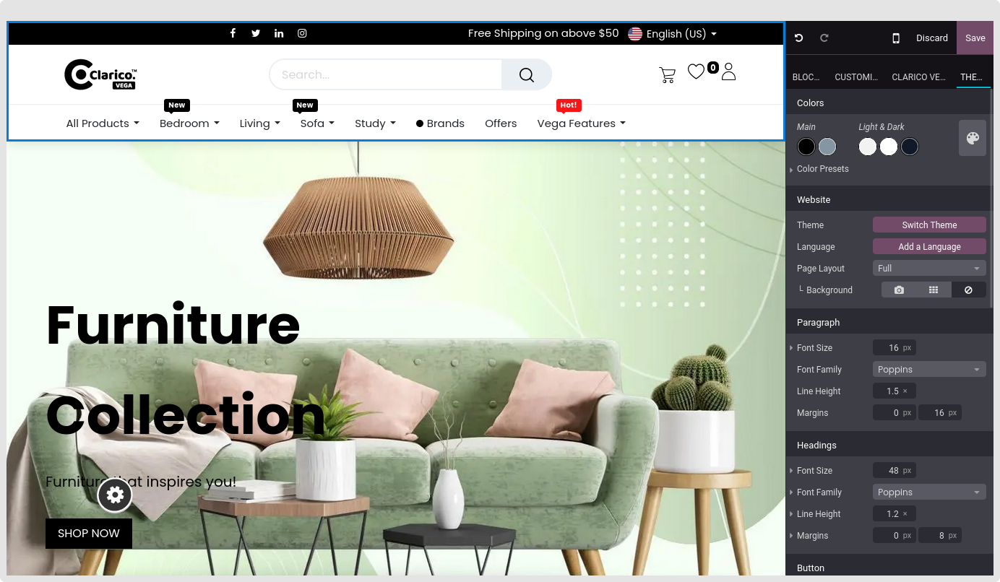
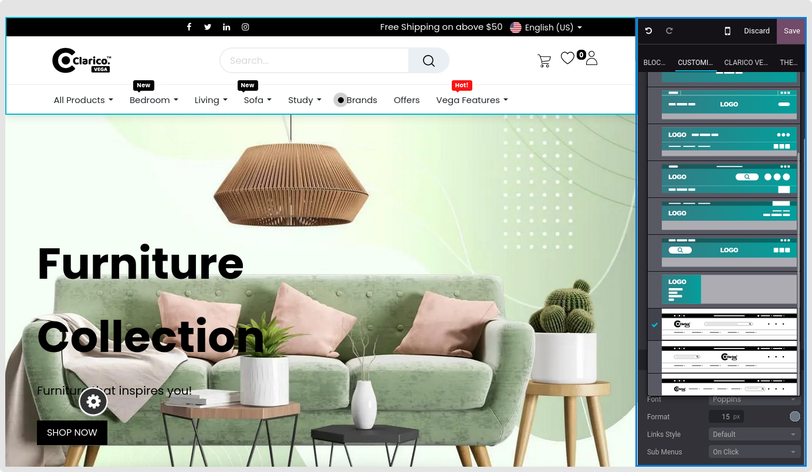
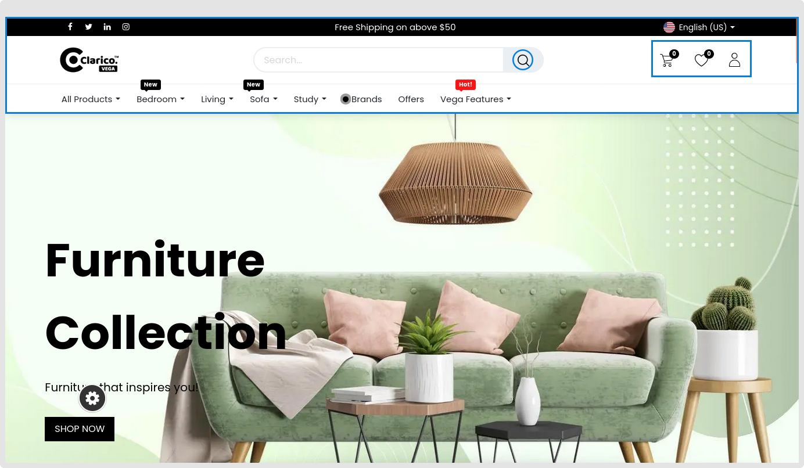

### Change Header Style

Website ->  Edit -> click on the Header as below.

 

* As seen in the picture below, you can see the list of different header options from the Header customise option. After making your selections, save the theme header.

 

{:.alert-warning} 
> 
> #### NOTE
> 
> To edit any icon, such as the Vertical Menu, Search, Wishlist, Shopping Cart, or User icon, if you are using Custom Header Style number 1, you must take the following actions:
> 
> 
> * Go to theme_clarico_vega/static/src/img/header_icons inside the theme folder
> * All of the previously stated icon images are available
> * Replace with a fresh picture of the same dimensions
> * After the server has restarted, examine the header behavior
> 
> 
> 

 

 

