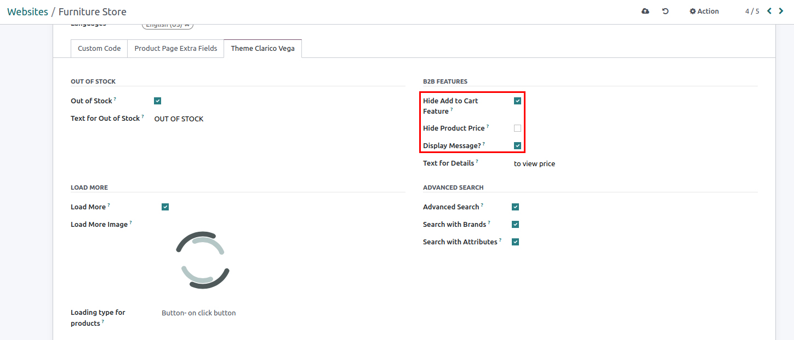
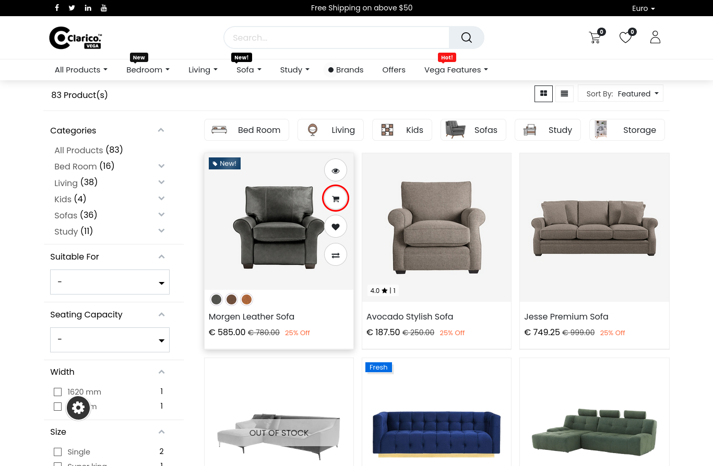
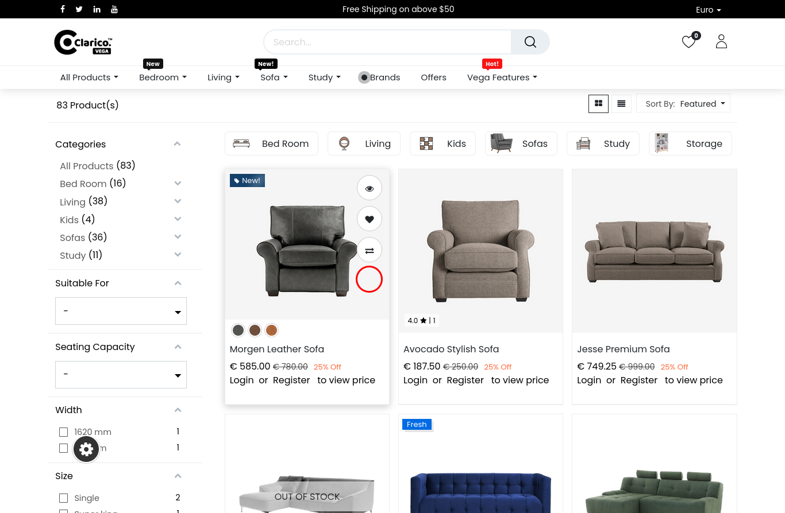
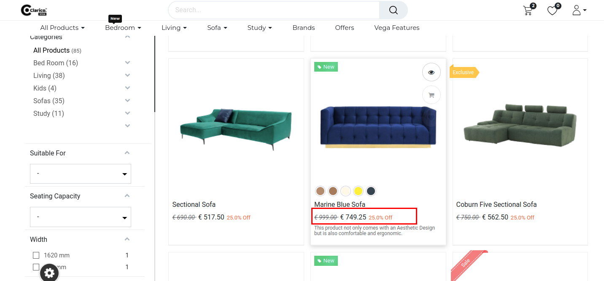
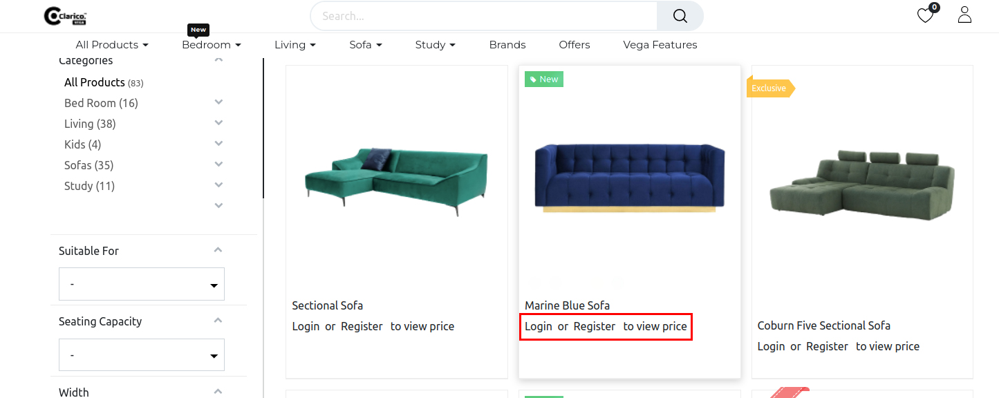

### Hide Add to Cart button & Price

You may manage price visibility on any product and category page by using the Hide Price & Add to Cart feature. On the website, you may choose to conceal the Price & Add to Cart button for guests.

* To activate or deactivate Configuration **website -> Configuration -> websites -> Select website -> Theme Clarico Vega Tab**

* There are 3 settings, as follows: Hide Add to Cart (B2B):
**Hide Add to Cart (B2B)**
* The Add to Cart button will be hidden from the Header, Dynamic Sliders, Shop, Product Page, Wishlist, Compare and Search bar, and Search result Page if this feature is enabled.
* Before

* After

**Hide Product Price**
* The price will be hidden from the header, dynamic sliders, shop, product page, wishlist, compare bar, and search result page if this functionality is enabled.

* Before

* After

**Display message**
* If this option is enabled, a message will appear for the guest user; if not, no message will appear.
* Before

* After

