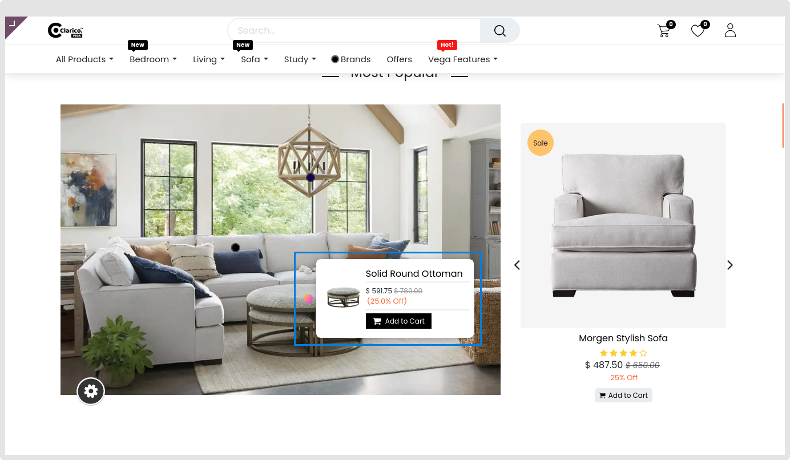
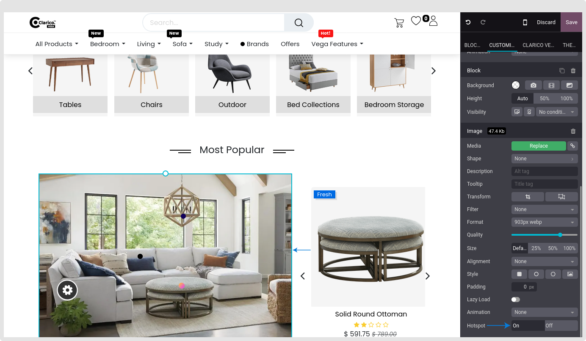
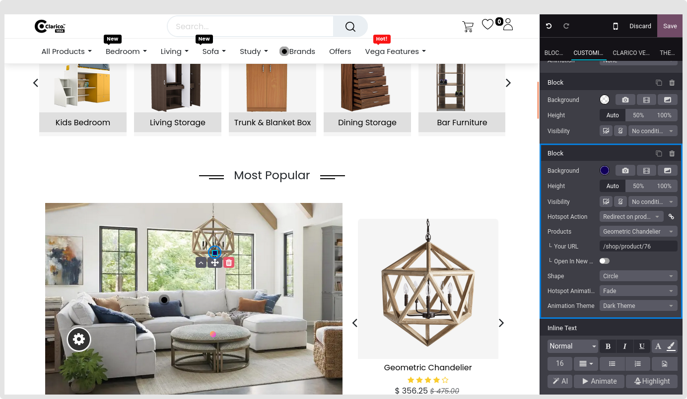
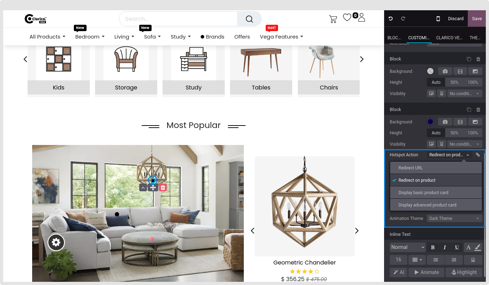
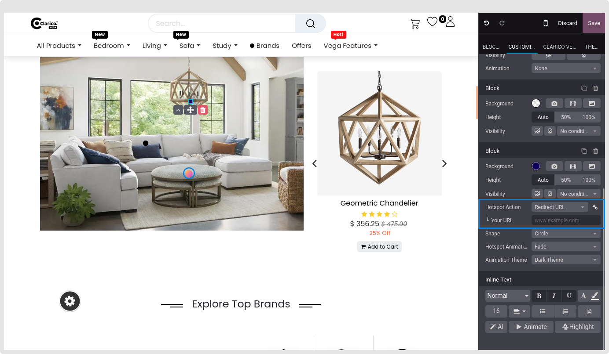
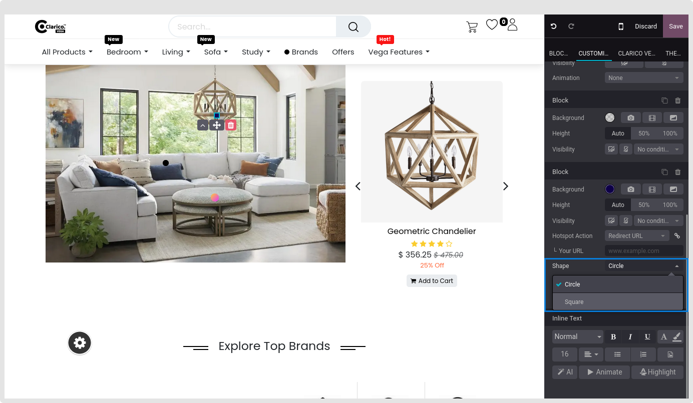
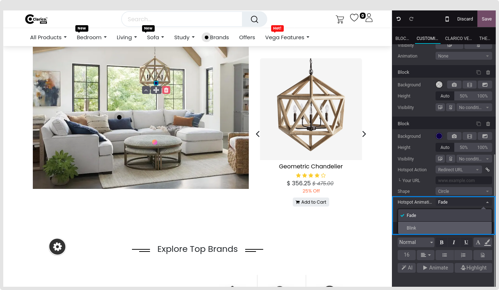
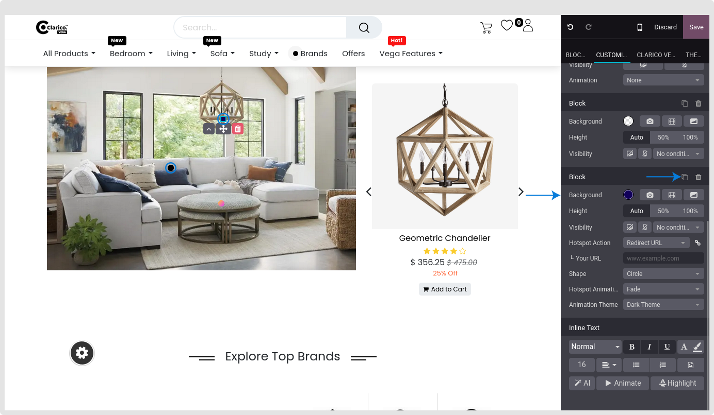

### Hotspot

Hotspot offering the ability to display the goods section with many alternatives for adding items straight to the basket. Offer the choice to see the offers in a different window as well.

To configure Hotspot - Go to the webpage where you want to configure the Hotspot. Click on the ‘Edit’ button from the top right & drop any below snippets as below:

Dynamic Snippets:
    - Banner With Product Slider
    - Product builder with banner
Sliders
    - Style 1
    - Style 2
    - Full Screen 2

* Select any product image you like for the corresponding excerpt.
* Once you have chosen that picture, go to the Editor settings in the lower right corner and toggle the Hotspot setting to On.

* By selecting Hotspot in the image, you may adjust Hotspot parameters like color, shape, animation, and hotspot action.

* **Hotspot Action Type:** Select any hotspot action from the drop-down menu based on your requirements. The following field to set the page URL or product will appear based on the option made.

**Hotspot Action**

* **Redirect URL:** Your Url, Open in a new window(Toggle button)

* **Redirect on the product:** Redirect on the product: Choose any product you want to see on the hotspot and fill in the product URL area below.
* **Display basic product card:** Any product may be chosen to be shown on the hotspot.
* **Display advanced product card:** Any product may be chosen to be shown on the hotspot.

* **Hotspot Color:** You may choose any colour to display as the hotspot.
* **Hotspot Shape:** To fit the general style of your theme, set any hotspot form using the Editor settings in the lower right corner.

* **Hotspot Animation:** Select the hotspot animation that blinks or fades.

* You have the opportunity to add as many Hotspots as you like depending on your items in the image by clicking the Hotspot and choosing the **Duplicate** symbol from the Editor choices in the lower right corner.

* Anywhere in the image can be the location of a hotspot.
* Finally, click the Save button to save your configuration. An picture will display a hotspot.

The Editor choices will show all of the previously mentioned settings.