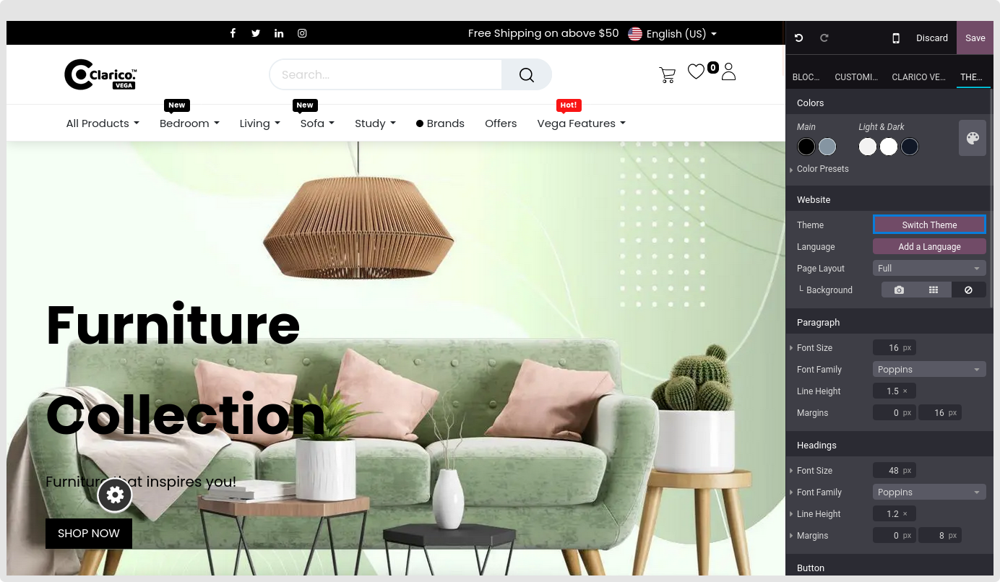
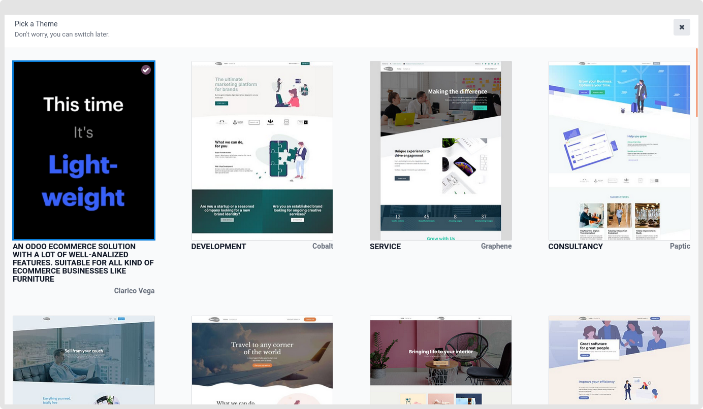

### Install & Update the Theme

Make sure you have downloaded the most recent versions of Odoo and Theme Clarico Vega, together with all of its submodules, before installing the Theme Clarico Vega.

**1. Install Theme**

You will receive many folders after downloading the Theme Clarico Vega from the Odoo store, with one folder called "theme_clarico_vega." Other directories are dependant modules, while this one is a theme folder.

Update your app list from the 'Apps' option in the admin view after adding all the folders to your addons directory and restarting the Odoo server.

Now go to **Website / Configuration / Settings**. In Website settings, select a website in which you want to install Theme Clarico Vega, click on the **PICK A THEME** button. You will be redirected to the list of available themes. Click on **Theme Clarico Vega to** Install it on your website.

**2. Update The Clarico Vega** 

To update the latest version of the theme, First, download it from Odoo Store and replace it with your existing Theme source code. There can be two scenarios for updating Theme features.

**a) Changes Into Emipro Theme Base:** These modules contain business logic and functional elements for all Emipro eCommerce themes. So if there are any changes in business logic, then you need to mandatory upgrade the "Emipro Theme Base" module.

**b) Changes Into Theme Clarico Vega:** ‘Theme Clarico Vega’ contains UI elements. So if there are any updates related to UI or template then you need to upgrade the Theme. For that, navigate to **Website / Edit / Themee** and click on **Switch theme** then update the theme.

 

{:.alert-warning} 
> 
> #### NOTE
> 
> **Technical Steps to Install/Update Theme Clarico Vega:**
> 
> 
> 1. Copy and paste theme\_clarico\_vega and emipro\_theme\_base code into your custom module (Add/Replace).  
> 
> 2. Restart the odoo services. (Ignore if you are using Odoo.sh)  
> 
> 3. Go to Apps -> Update List (Please start debug mode first otherwise it will not show this menu).  
> 
> 4. Find emipro\_theme\_base module & Install/Upgrade that module.  
> 
> 5. Install/Update a theme Clarico Vega from Website Configuration.
> 
> 
> 

 

