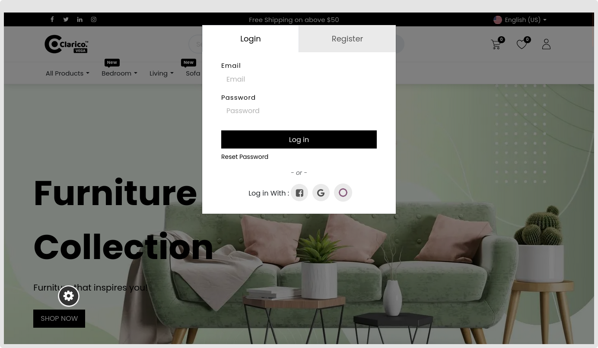

### Log in & Sign up Popup

The consumer may rapidly register and log in thanks to this functionality. They are not required to look through the Register / Login page. Customers may input their login, password, registration link, password reset, and authentication provider all in one pop-up window. They are therefore spared from having to go through every page for certain tasks.

Open Website Editor from the website and choose **Clarico Vega** to activate the Log In & Sign Up window. The option to log in pops up is available, as seen in the image below. Save the modifications and enable that option.

 

 

