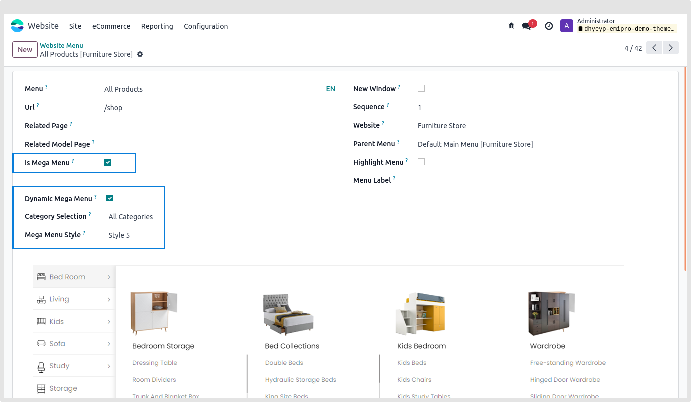
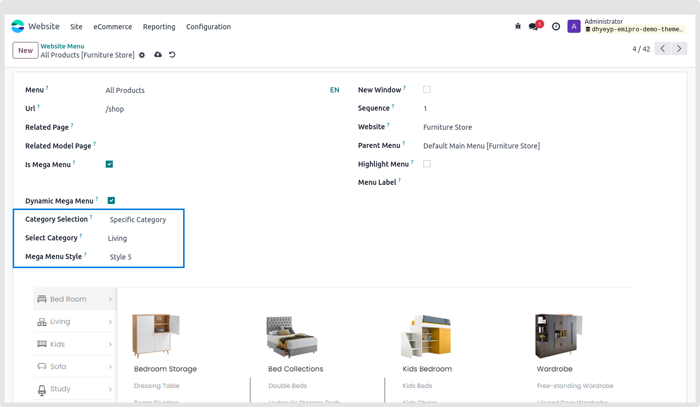
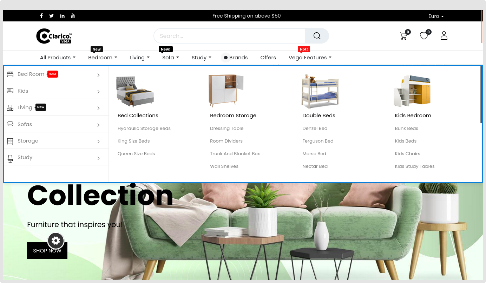
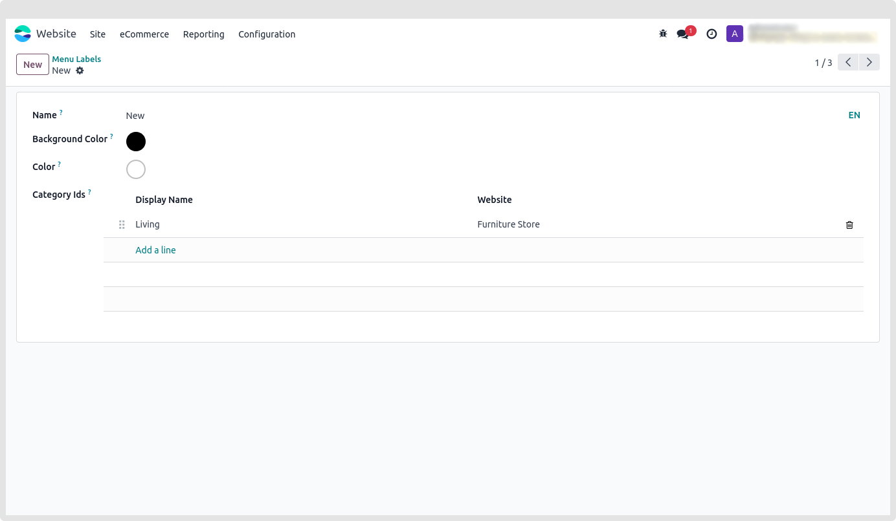
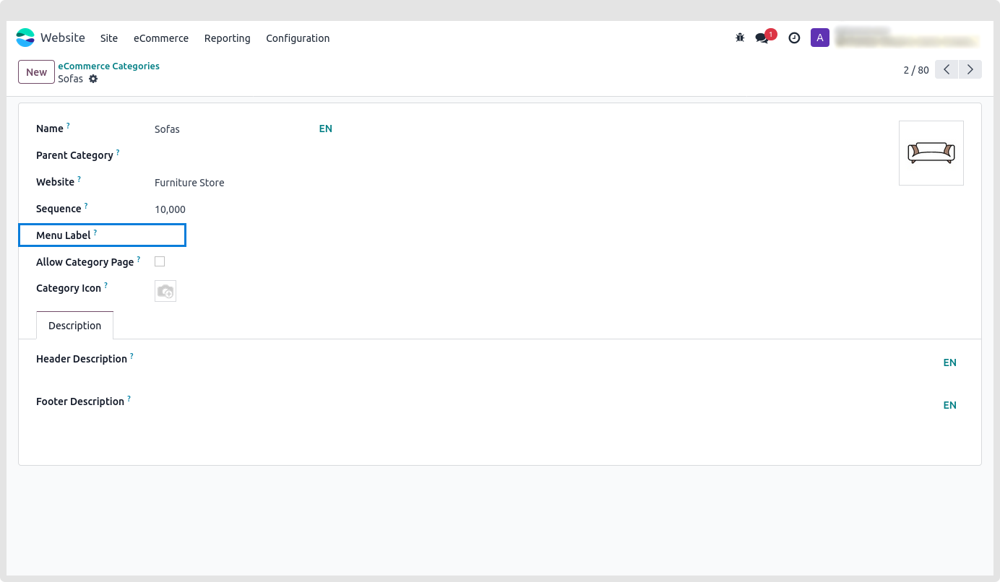
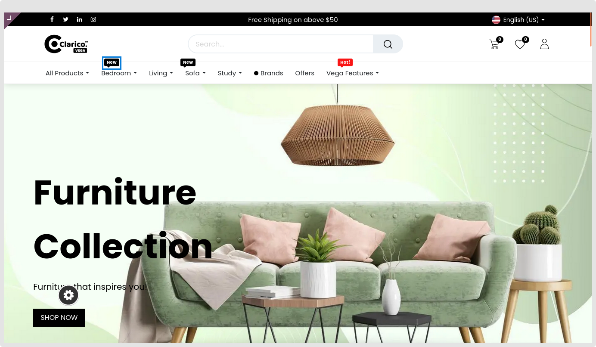

### Dynamic Mega Menu

Using this functionality, you can choose an entire or a particular e-commerce category from the backend to build a dynamic mega menu. Applying one of six possible styles depends on the selection

The steps to develop a dynamic mega menu are as follows.

* **Step 1:** Locate and click the "Activate the developer mode" item in the settings.
* **Step 2:** Navigate to Configurations > Menus > Create new on a website.
* **Step 3:** Include the menu name
* **Step 4:** Verify whether the menu is a mega menu. Dynamic mega menu will be one of the options that appears after checking this box. Upon choosing this option, the remaining fields will become active.

#### 1. Category Selection:
There are two alternatives for you to choose from when it comes to what category appears in the menu. **Every category** as well as the **specific category** (the specific category option is set by default)

#### 2. Select Category:
Only this field will show up if you have chosen the Specific category under Category Selection. Choose a category now for that specific dynamic mega menu.

#### 3. Mega menu Style:
You may choose any one of the six styles based on your preferences. 

You may view the outcome on the website after saving the menu.

{:.alert-warning}
>#### Note
> **Dynamic mega menu functionality will be compatible with on hover option.**
>

#### Category Menu Labels

 - You may use this functionality to show the menu label for a certain category or menu
 - Navigate to **Websites>Configurations>Menu Labels** in the Admin panel to activate the Menu label feature.

* **Step 1:** Create a new Menu Label

* **Step 2:** Navigate to Configuration > E-commerce categories > Choose any category to add a menu label to. The **menu label** field to choose from the list of potential menu labels is shown.

* **Step 3:** By inputting the label's name and selecting **create and edit,** you can also create a new menu label from the eCommerce category.

* **Step 4:** Based on the requirements, choose the background and text colours of the constructed menu label.

* **Step 5:** The website's menu labels for the categories listed below will be visible.

