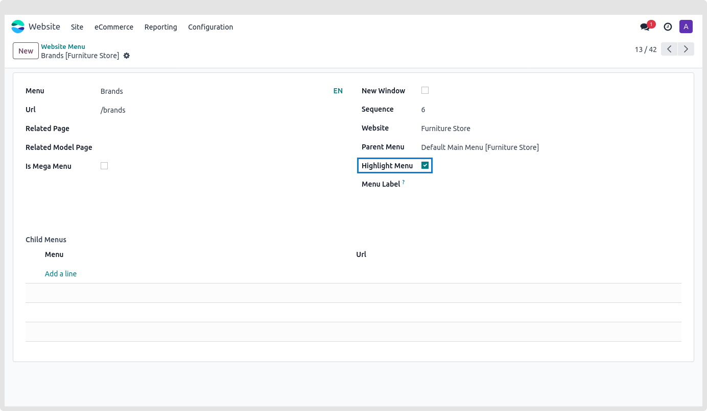

### Highlighted Menu

Sometimes there is a need to highlight a particular menu item. You can highlight a menu by adding a different background color, text color, etc to the particular menu item using custom CSS.

How to make the menu stand out:

* **Step 1:** Select any menu on a website and click it to add the highlighted menu. This is how to make a highlighted menu.

* Step 2: choose the Is Highlight Menu item. 

 This option sets the menu item to be highlighted when it is selected.

Please uncheck the Is Highlight Menu option if you would like to remove this highlighted menu.

{:.alert-warning} 
> 
> #### NOTE
> 
> Multiple Highlighted Menus may be specified, and the buddle background colour is being used as the primary colour. There's no way to modify that background setup.
> 
> 
> 

