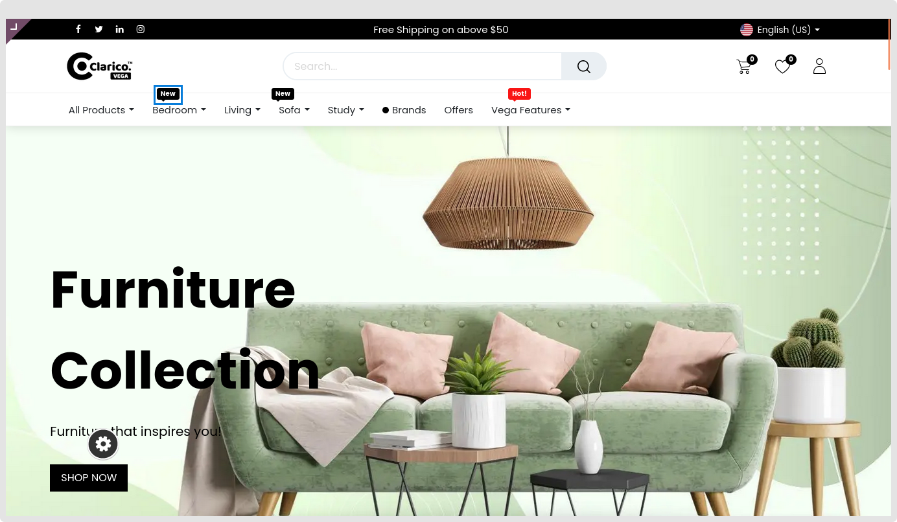

### Menu Label

* You may show a single label on the right or top of the menu by using this functionality. Additionally to changing the menu label's colour, you may add the label's display text.
* Go to **Web Pages / Customise / Customise Theme / Menu labels** to activate or deactivate the Menu label feature.

How to set up menu labels:

* **Step 1:** Select the edit menu option by going to the Pages tab. An edit menu will appear for you to choose from.
* **Step 2:** Choose the menu that you like the menu label to appear on. A popup menu item window will show up when you click on the menu item.
* **Step 3:** Click the **Save** button after entering the menu label and menu label text in the colour you choose for the menu label.

{:.alert-info} 
> 
> #### TIP
> 
> You can assign menu label and colour at the time of menu creation or later on from the website editor panel. 
> 
> 
> 

 

