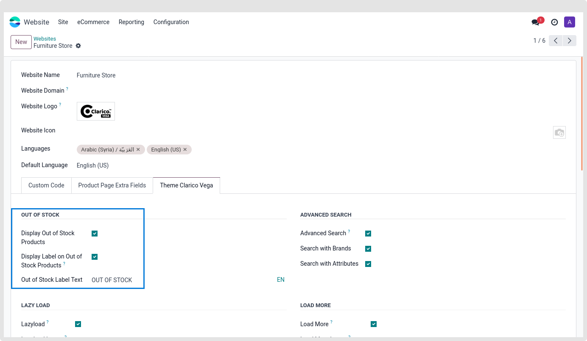
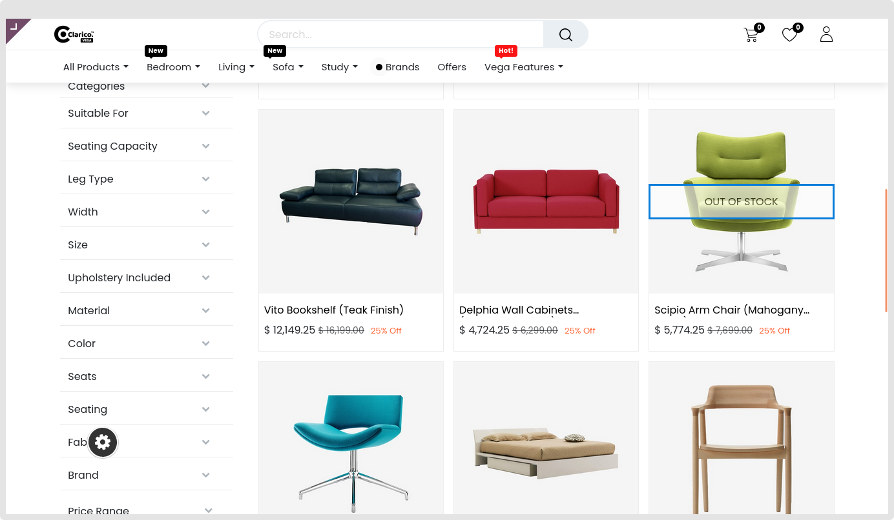

### Out Of Stock Label

* When you don't have enough product quantity in your warehouse for the specified website, this feature will show labels.

{:.alert-warning} 
> 
> #### NOTE
> 
> **This function is only applicable to storable products without the Out-of-Stock option selected. The following pages will show "out of stock": Grid view and list view for the shop page, dynamic product sliders, compare and wishlist pages**
> 

* Next, you may type a message that you wish to appear in case the product is out of stock.

* By selecting the language short code, you are also able to translate that content.

* The notification on the unavailable amount of a certain product will be shown on its picture.

