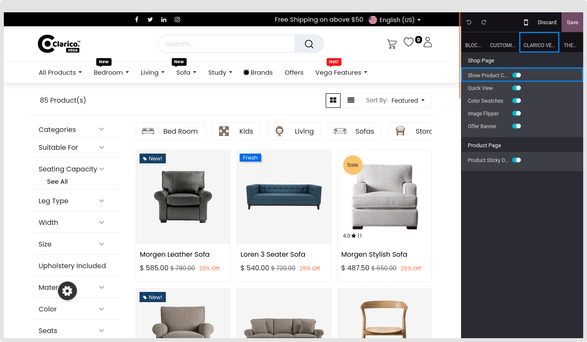
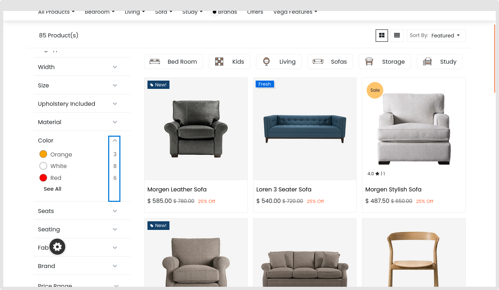

### Product Count

The corresponding product count is shown by this feature in the Attribute listing. Click the Clarico Vega option while opening Website Editor from the website to enable Product Count in Shop Filter. As seen in the screenshot below, the product Count is available in the Shop Filter option. Save the modifications and enable that option.

As seen in the picture below, once this option is enabled, you may view the number of Products in the attribute listing.

