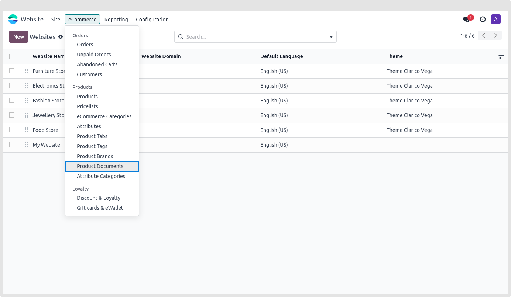
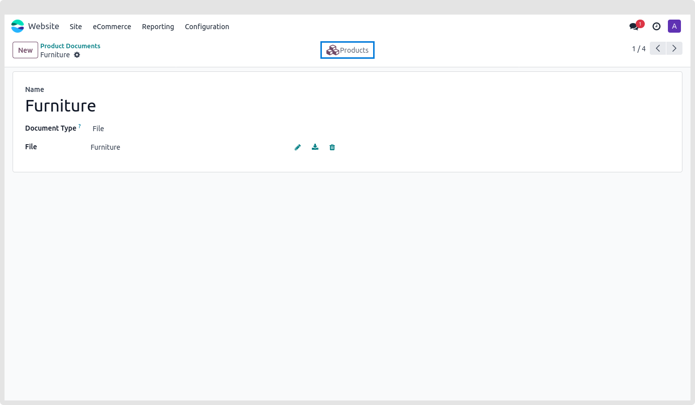
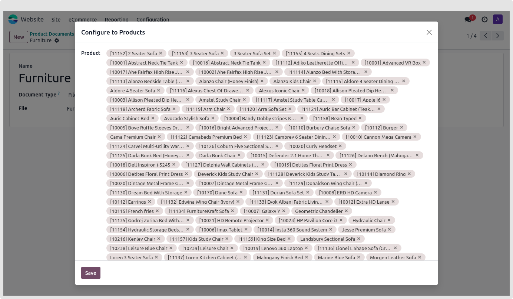
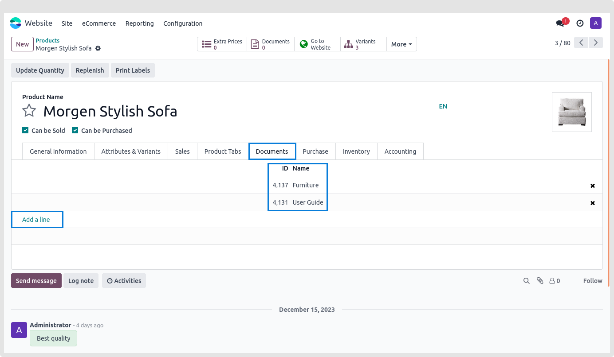
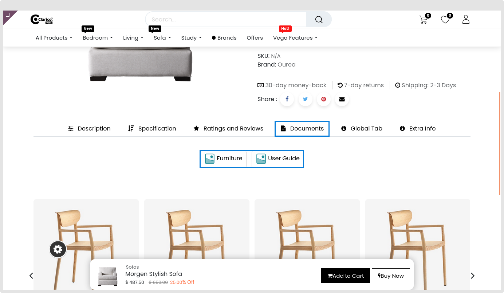
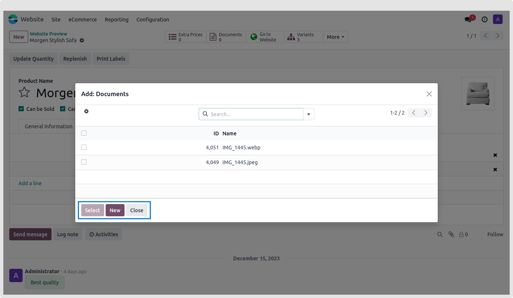

### Documentation Tab

The administrator may upload several documents, such as a user manual or terms and conditions, in the format of their choice, and link them to every product on the planet.

You may provide your consumer with the following functionalities on the Product page by using this feature:

1. Customers can download any type of document
2. Customers can click on any link, internal or external

* **Step 1:** To see the document list, navigate to Website > Products > Product Documents, as seen in the illustration below. From that angle, you may begin a new document by uploading a file or a URL.

* **Step 2:**  When you open any document, the Products smart button will be available in the form's top right corner. Following your click on that button, a wizard will show up allowing you to select one or more items before clicking the Save button.

* **Step 3:** The document will be linked to each of the chosen products as soon as you save this modification. The same procedure may also be carried out inside the Product form view.

**The wizard below will popup when we click the Add line button.**

**Following the conclusion of this procedure, the documents are shown as follows on the product page.**

