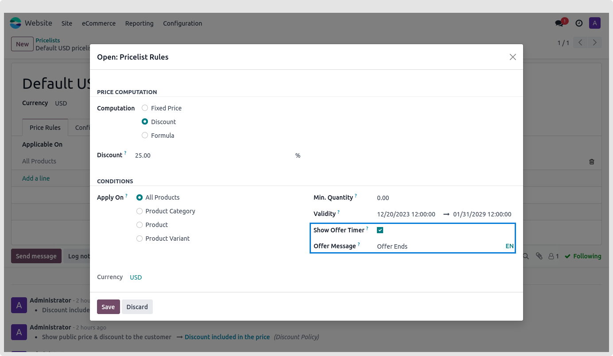

### Offer Timer

An offer timer based on All Products, Product Category, Product, and Product Variants is available from us. On a product page, it displays the countdown to the remaining product offers.

You must set a pricelist before you can specify the offer timer. Verify that the website's settings have the discount and multiple sale pricing active. One pop-up window will open once you click on Add a line of pricing. Choose the relevant "Apply on" option, then set up the Offer Message, Start Date, End Date, and Display Timer..

As seen in the picture above, the Offer timer is visible on the Product page.

