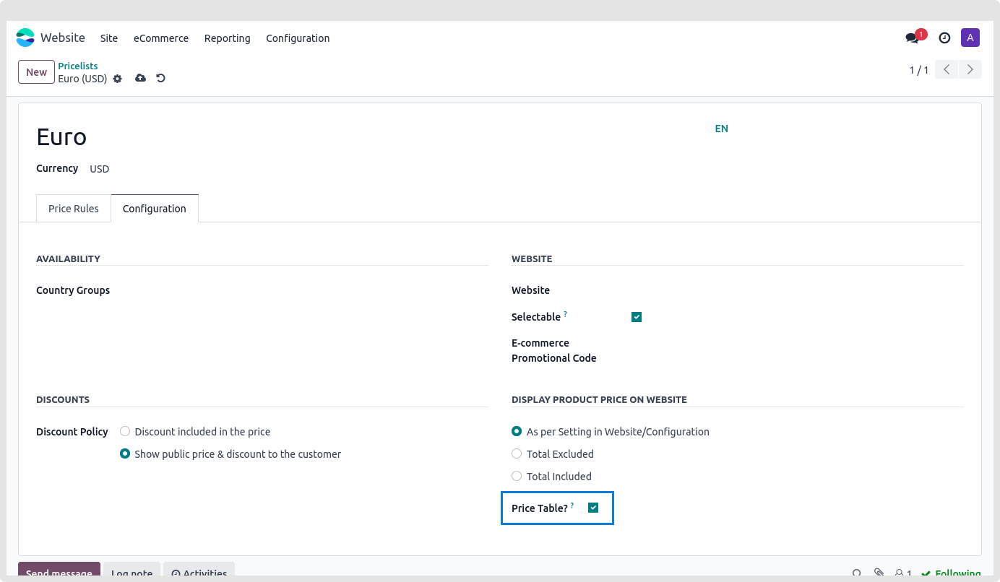
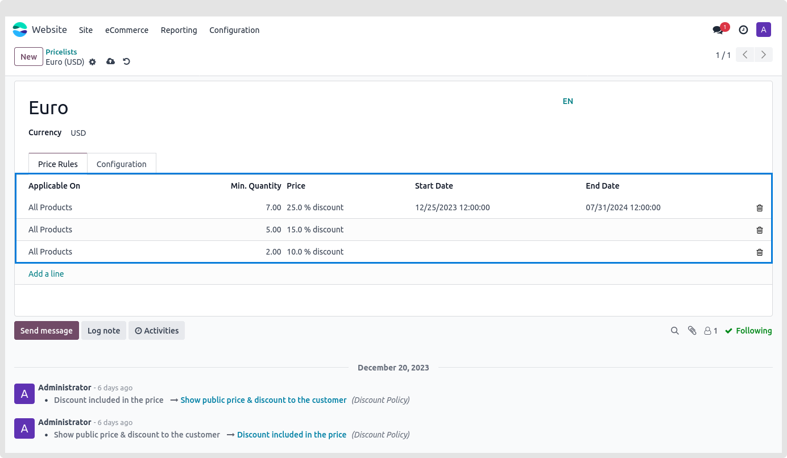
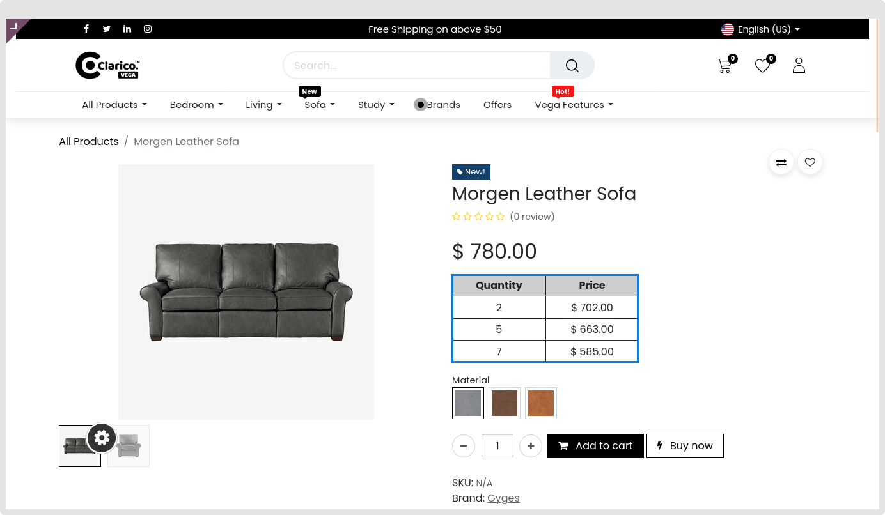

### Price Table

The "Price Table" feature empowers you to showcase all applicable price rules for the current product directly on the product page. By enabling this option, you provide customers with transparent visibility into the available pricing options. Follow the steps below to configure this option in your pricelist.

Enabling Price Table:

* **step 1:** Navigate to your pricelist configuration.
* **step 2:** Enable the **Price Table** option as illustrated in the screenshot below.

* Example Scenario:

* For instance, consider you have established a rule in your pricelist for minimum quantities such as 1, 2, and 10. Upon enabling the "Price Table" configuration, when a customer visits the product page for that specific product, all applicable rules for that customer will be displayed.

* This feature enhances the customer experience by presenting relevant pricing details, providing them with a comprehensive understanding of the available options tailored to their needs.

