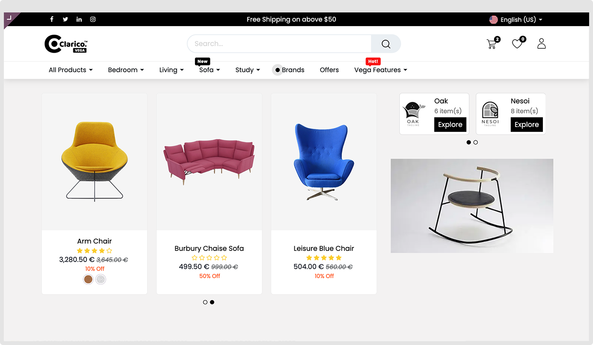
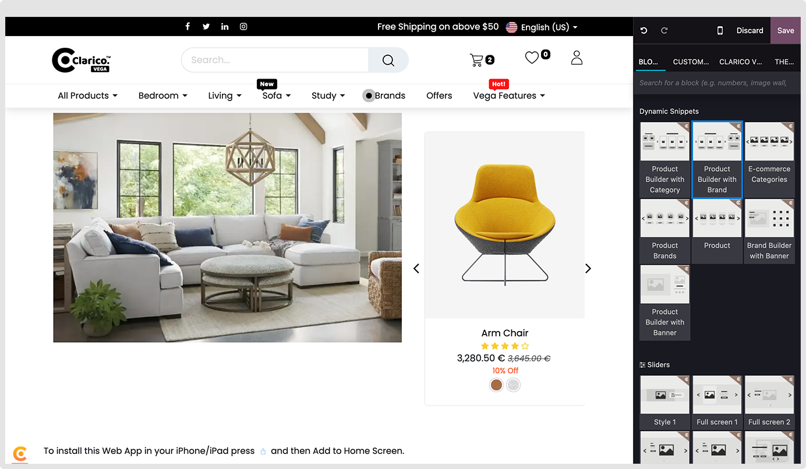
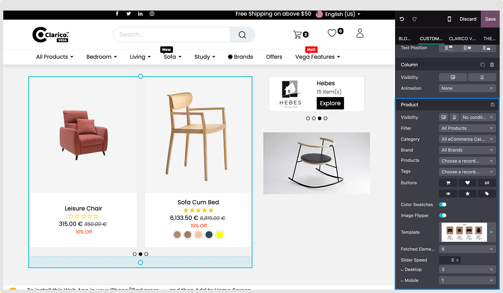
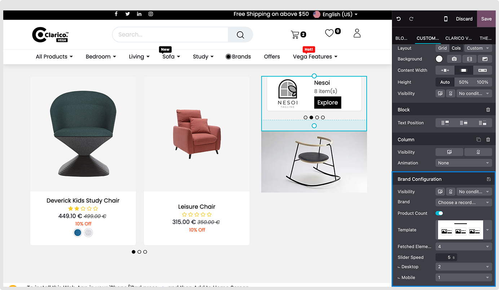

### Product Builder With Brand

Showcase your product with brand using a trending image or product/category/brand

**Step: 1** Go to website -> Editor -> Edit
**Step: 2** Click on Block Tab -> Under Dynamic Snippets option, drag and drop Product Builder With Brand

**Product Configurations**

**Step: 1** Select Product slider, -> Select filter by option from dropdown (Where you can load product, Brand, category and Product Tags)
**Step: 2** Set Button and other options you want in your sliders
**Step: 3** Change additional options depending on your needs.

**Brand Configurations**

**Step: 1** Select Brand you want to show
**Step: 2** Select the product count option if you would like to show the number of product associated with that brand
**Step: 3** Change additional options depending on your needs.

**Image Configurations**
Upload any image and set appropriate links