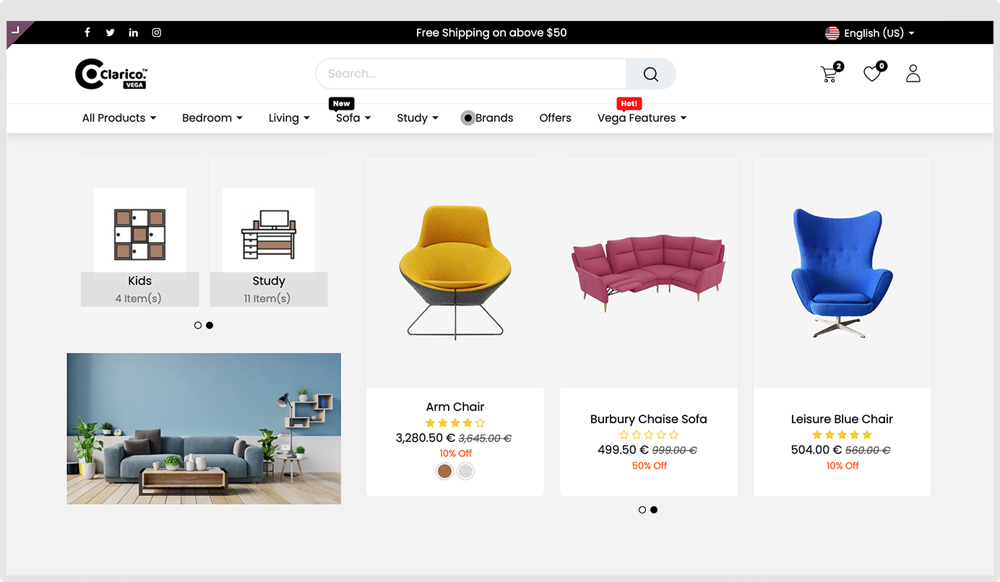
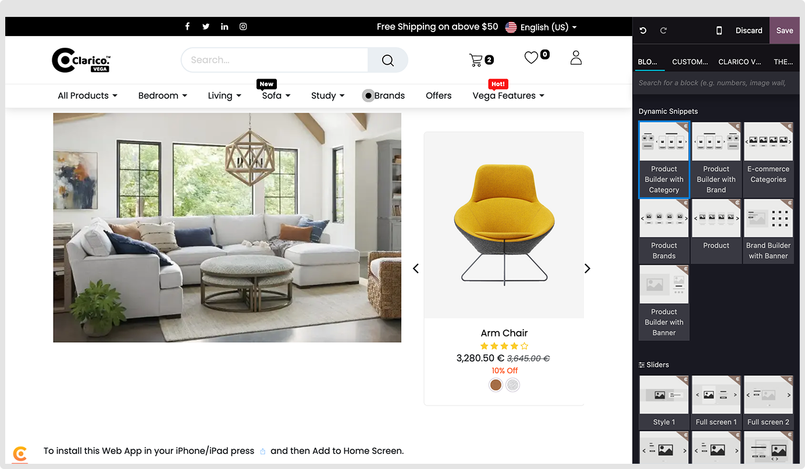
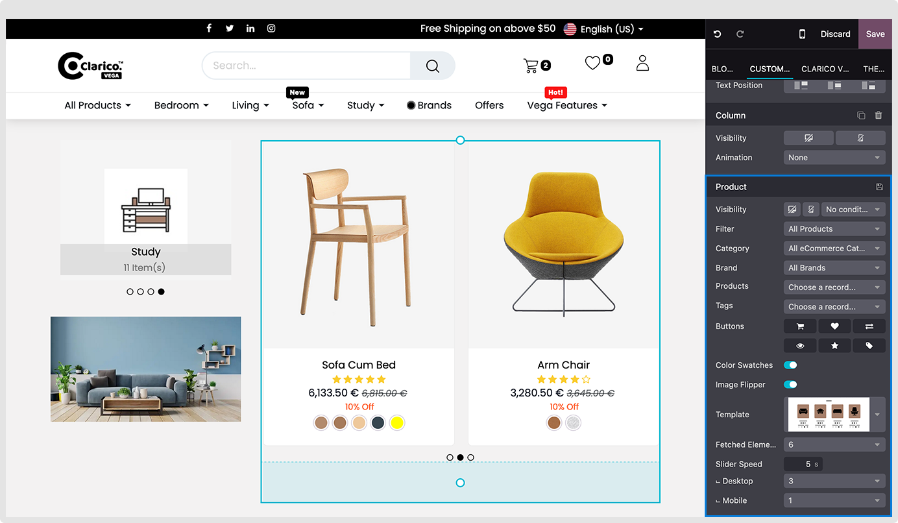
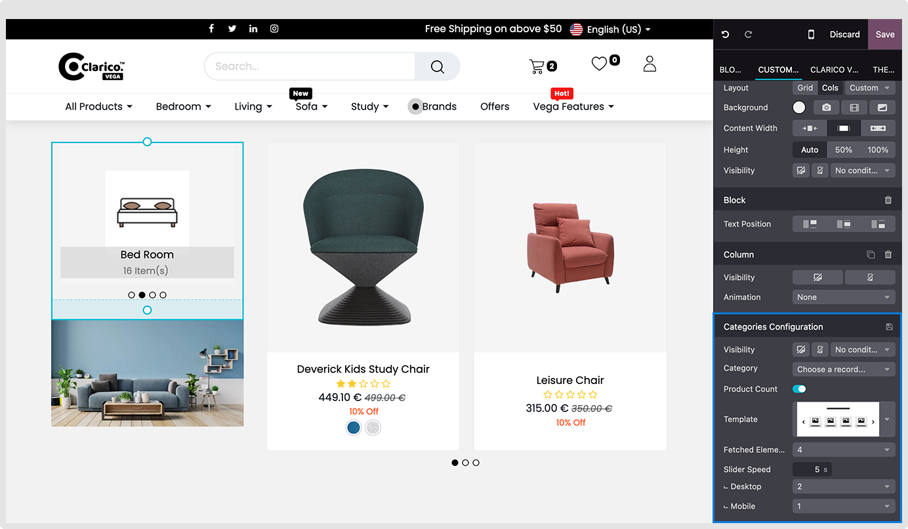

### Product Builder With Category

Set Product slider and category slider with a trending image or product/category/brand

**Step: 1** Go to website -> Editor -> Edit
**Step: 2** Click on Block Tab -> Under Dynamic Snippets option, drag and drop Product Builder With Category

**Product Configurations**

**Step: 1** Select Product slider, -> Select filter by option from dropdown (Where you can load product, Brand, category and Product Tags)
**Step: 2** Set Button and other options you want in your sliders
**Step: 3** Change additional options depending on your needs.

**Category Configurations**

**Step: 1** Select category you want to show
**Step: 2** Select the product count option if you would like to show the number of product associated with that category
**Step: 3** Change additional options depending on your needs.

**Image Configurations**
Upload any image and set appropriate links

**Note:** You can change the template of the product category sliders.
