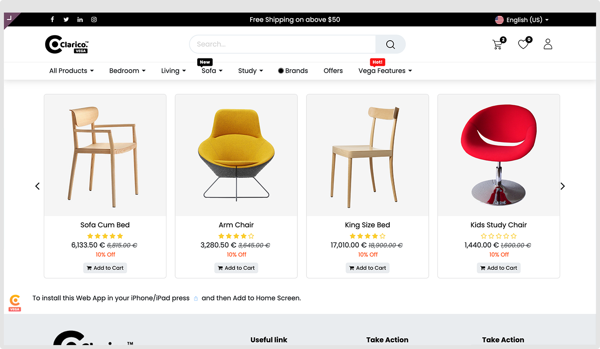
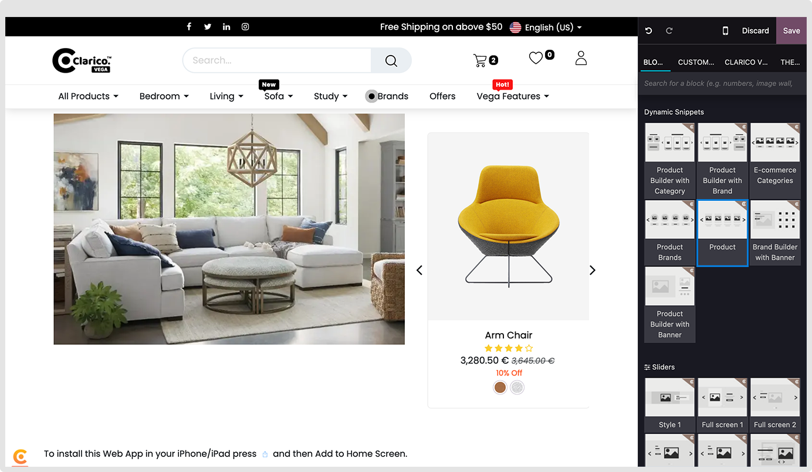
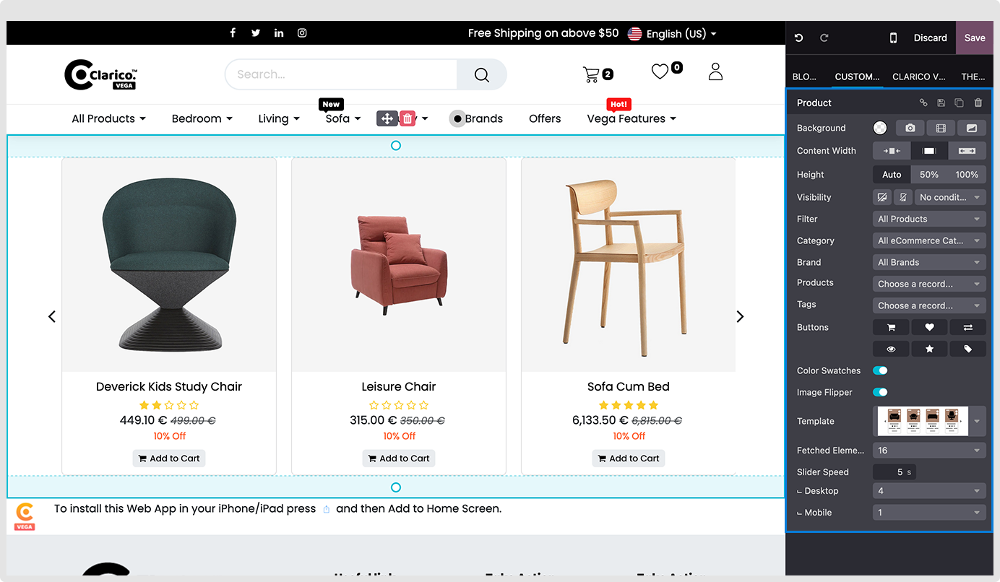

### Product

Set Product slider and category slider with a trending image or product/category/brand

**Step: 1** Go to website -> Editor -> Edit
**Step: 2** Click on Block Tab -> Under Dynamic Snippets option, drag and drop Product

**Step: 3** Select filter by option from dropdown (Where you can load product, Brand, category and Product Tags
**Step: 4** Change other options based on your need and update the style as well

**Note:** You can enable/disable the buttons, Image color swatches and image flipper