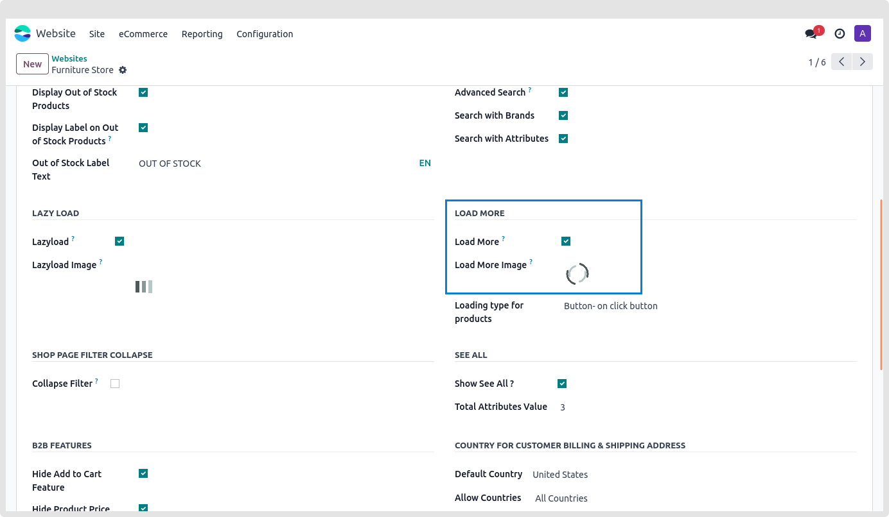
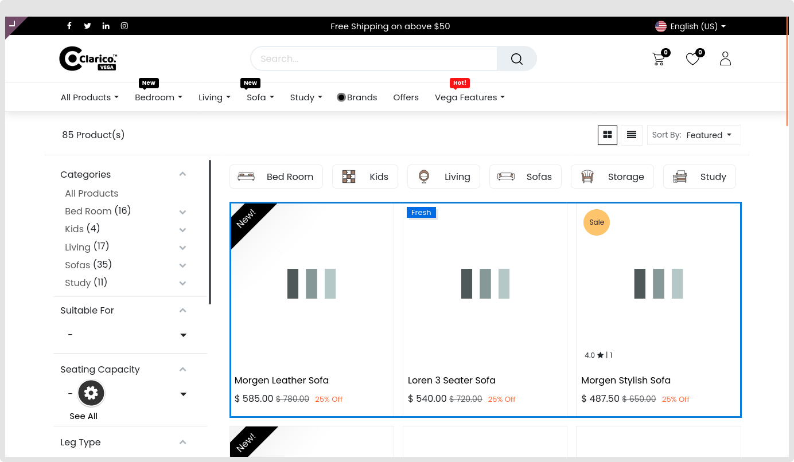

### Lazy Load

Instead of loading the entire web page and displaying it to the user, it merely loads the necessary section and waits the rest until the user needs it.

Navigate to **Website / Configuration / Settings / Lazy Load** to enable or disable this feature.

Users can set the image of the lazy load and it will be shown while page loading. Recommended Image size: 80 X 80.

On the Shop page, users may apply Lazy load to all product and offer slider styles, category sliders, offer category sliders, bestseller new product sliders, accessories, and alternative sliders.

