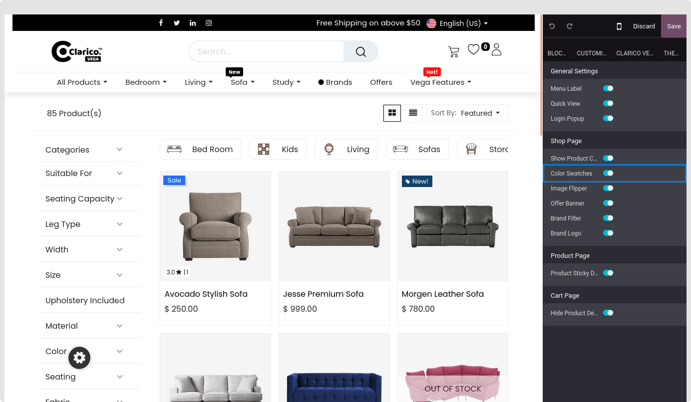
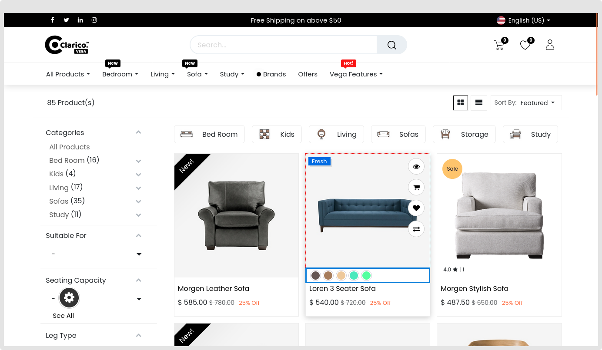

### Product Color Variants

* This tool allows you to see how many colors are available for a certain product without having to go to the product page.Hovering your mouse pointer over the color/image icon will display an appropriate image of the product.

Open Website Editor from the website and select the Clarico Vega Tab to activate or disable the Color Variants.

According to the screenshot below, you can discover the option to activate or disable the Color Variants from that configuration.

* You may view the Color Variants in Shop page after activating this feature.

{:.alert-warning} 
> 
> #### NOTE
> 
> Only color characteristics with Display Type will be compatible with this functionality.When a product has more than one color property, the first color variation will be shown.
> 

