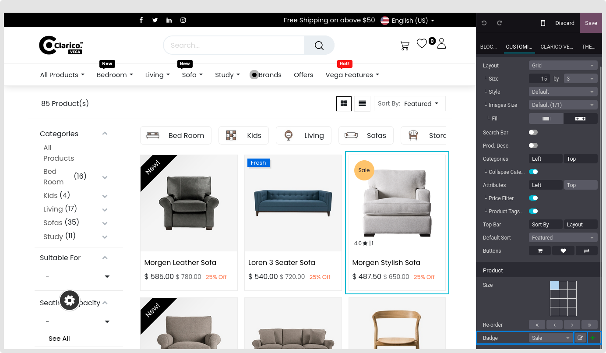
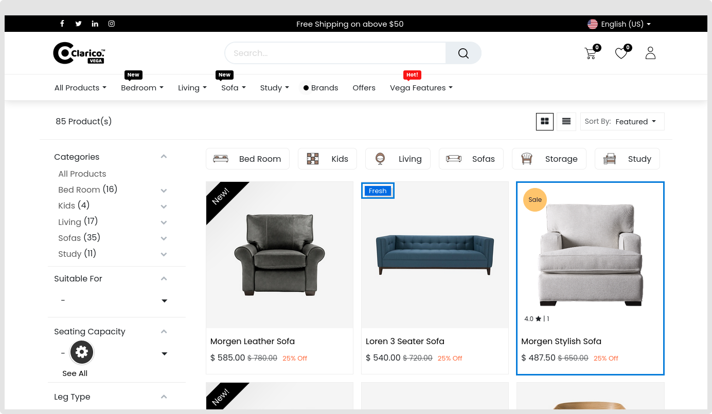

### Product Ribbons Design

* **Step 1:** Click on the product you wish to add the ribbon to after opening Website Editor from the website. Select Product, Badge, Edit.

* **Step 2:** Click on the style where we've offered three options after adding content.

* **Step 3:** To make the changes take effect, click save.

{:.alert-warning} 
> 
> #### NOTE
> 
> It is configurable from the backend
> 

