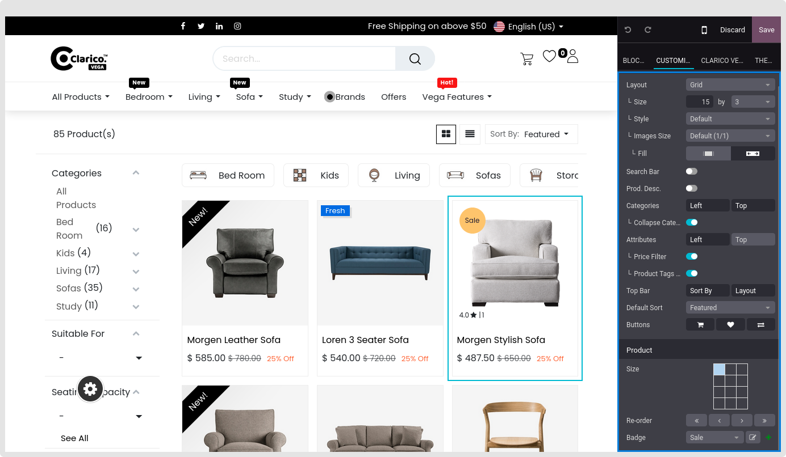

### Shop Page Configuration

According to the screenshot below, you may adjust the settings linked to your shop from the top of the Shop page on your website.

{:.alert-warning} 
> 
> #### NOTE
> 
> It is recommended that you disable Comparison List and Wishlist from the front end (as seen in the picture above) rather than adjusting the website settings from the back end.
> 
> 
> 

 

