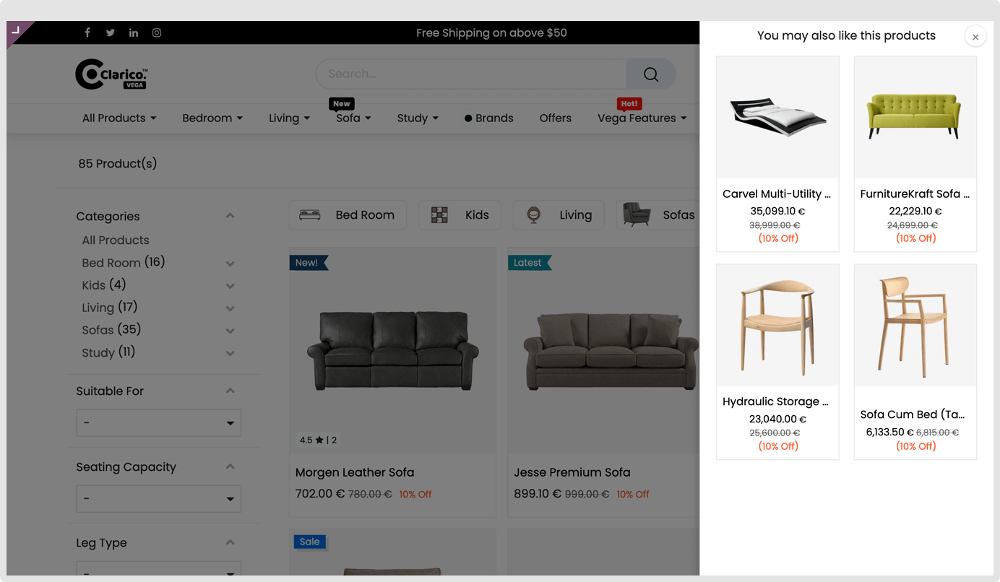

### Similar Products

Similar products refer to items that closely resemble each other in terms of their attributes, functionality, or purpose. These items serve the same or a similar purpose, offering comparable specifications and making them suitable alternatives for a particular use case. Customers seeking a specific item may explore similar products to find alternatives that meet their requirements or provide similar benefits.

Refer to the above image for Similar Products on the Shop Page.

The option to view similar products will be seamlessly integrated into your website's shop page, enriching the user experience. This feature enables customers to explore additional options aligned with their preferences.

**Step 1:** Navigate to Website -> eCommerce -> Products -> Products.
**Step 2:** Use the search function to locate and open the specific product for which you want to set similar products.
**Step 3:** Click on the "Sales" tab, and in the "UPSELL & CROSS-SELL" section, find the option for "Alternative Products."
**Step 4:** Set the appropriate products you want to designate as similar products.

**Enabling/Disabling Similar Products Option:**

Manage the visibility of the similar products option through the Clarico Vega editor in your website's backend. Enable or disable the "Similar Products" option based on your preferences.